# Pocketry

Pocketry is an open source project that turns photographs of items or tools into
editable outlines, shadow-board files, and printable Gridfinity bins. The
application runs in the browser, with image processing, project storage, and
model generation kept on the user's device.

[Try Pocketry](https://pocketry.xyz) ·
[Sample projects](samples/README.md) ·
[View the source](https://github.com/wcscr/pocketry) ·
[Read the license](LICENSE) ·
[Read third-party notices](NOTICE)

Pocketry's public deployment is [https://pocketry.xyz](https://pocketry.xyz).

## What it does

- Trace and refine outlines from PNG or JPEG photos.
- Calibrate dimensions and correct perspective with printable reference sheets.
- Design Gridfinity or flat bins with custom pockets, finger access, and colors.
- Preview in 3D and export fit checks, STL, or 3MF models.
- Export SVG or DXF files for shadow boards and CNC work.
- Save projects locally, undo changes, and export editable backups.

Check dimensions against the real items and print a fit test before the final bin.

## Sample projects

Browse the [sample projects](samples/README.md) for editable JSONs, 3MF print
models, and photos of finished bins. The collection includes a Wolfbox MF70 Airduster Kit,
DeWalt right-angle tools, a Ryobi cutter, caliper storage, a stapler, wire
strippers, a Klein voltage tester, and a Citadel mouldline remover.

[Download the complete sample library](samples/pocketry-sample-library.json)
to import all eight designs at once.

| **[Wolfbox MF70 Airduster Kit](samples/wolfbox-mf70-airduster-kit/)** | **[DeWalt right-angle tools](samples/dewalt-right-angle-tools/)** |
| :---: | :---: |
| <a href="samples/wolfbox-mf70-airduster-kit/"></a> | <a href="samples/dewalt-right-angle-tools/">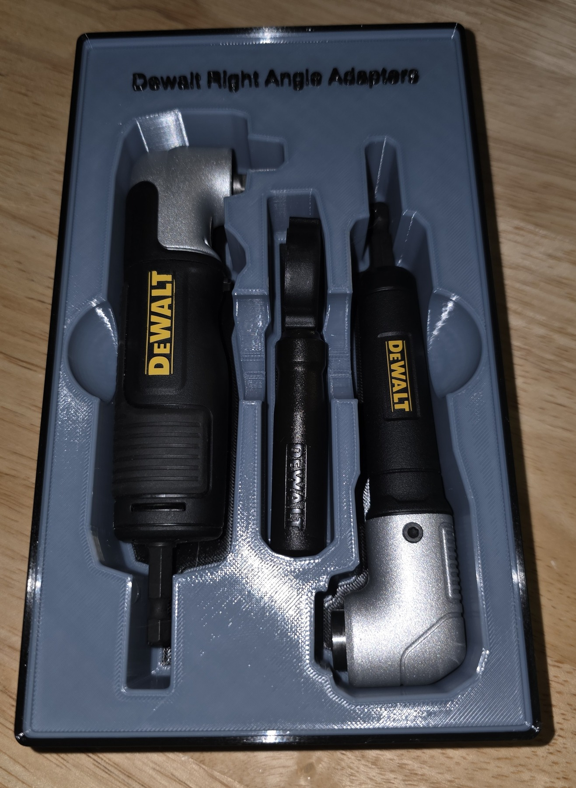</a> |
| **[Ryobi cutter](samples/ryobi-cutter/)** | **[Wire strippers](samples/wire-strippers/)** |
| <a href="samples/ryobi-cutter/"></a> | <a href="samples/wire-strippers/"></a> |
| **[Caliper storage](samples/caliper-storage/)** | **[Stapler](samples/stapler/)** |
| <a href="samples/caliper-storage/">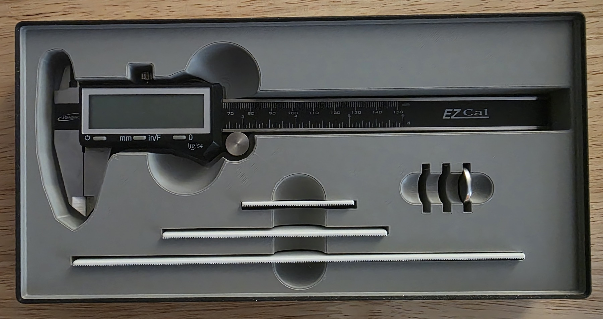</a> | <a href="samples/stapler/">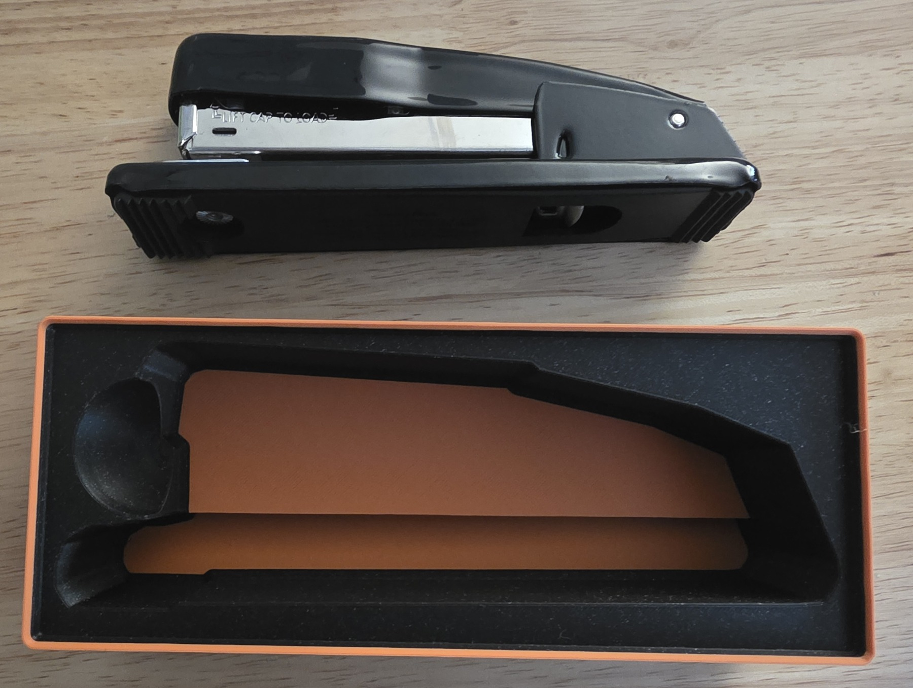</a> |
| **[Klein voltage tester](samples/klein-voltage-tester/)** | **[Citadel mouldline remover](samples/mouldline-remover/)** |
| <a href="samples/klein-voltage-tester/">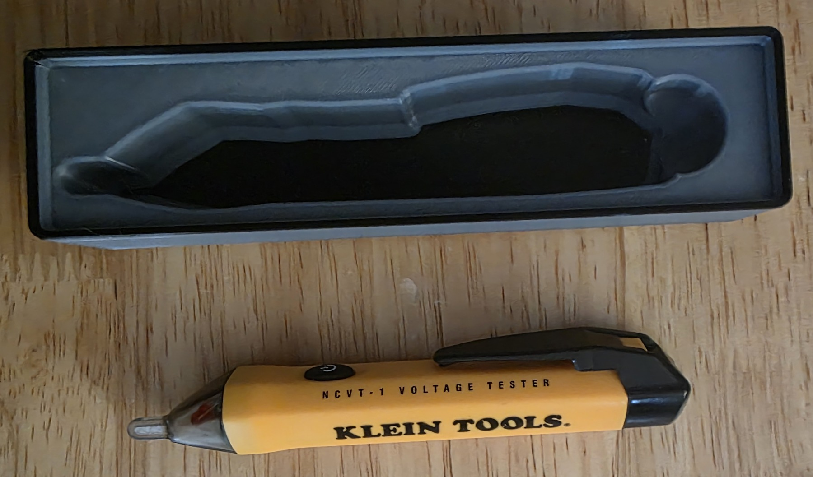</a> | <a href="samples/mouldline-remover/">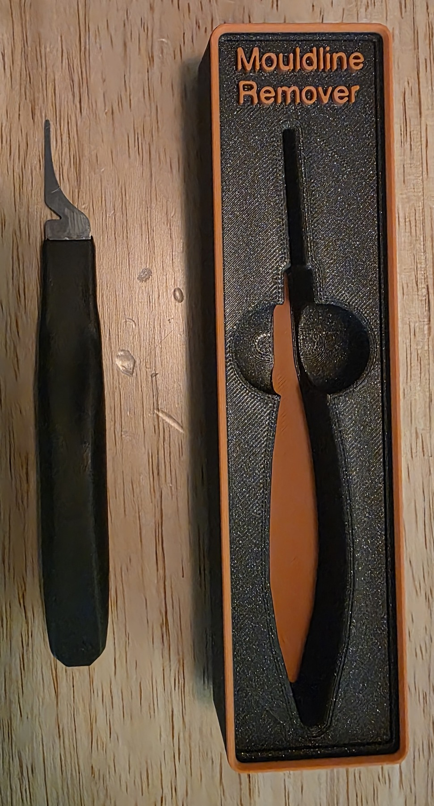</a> |

We'd love to see what you make with Pocketry! If you share a design on MakerWorld,
Printables, or elsewhere, please give Pocketry a shout-out and link to
[pocketry.xyz](https://pocketry.xyz).

## Basic Process

### 1. Trace and refine the outline

Import a photograph, calibrate its scale, and edit the detected outline to follow
the tool's shape.

For a manual scale, place the ruler endpoints on a known feature, enter its
length, then press Enter or **Confirm scale**. **Simplification** controls point
count: higher values use fewer points and can lose small details. Physical Trace
exports require a confirmed scale and show the resulting dimensions before
download; an unscaled outline can still be exported as an SVG in pixels.

The current Trace draft is saved in this browser, including its photo, scale,
edited contours, and undo history. Wait for **Trace draft saved in this browser** before
closing the page. This recovery copy is local to the browser; replacing the photo
or choosing **Start over** replaces or clears it. Export a project backup for a
portable copy of a calibrated outline and its bin settings.

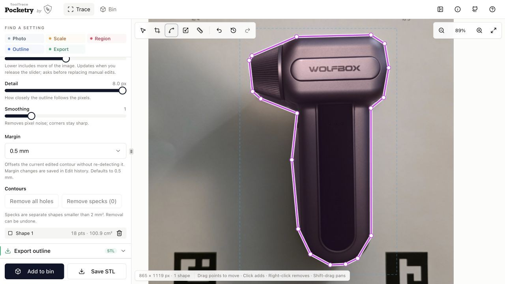

### 2. Arrange the pockets

Move the tool outlines into a Gridfinity bin, arrange the duster and accessories,
and add finger access for lifting them out.

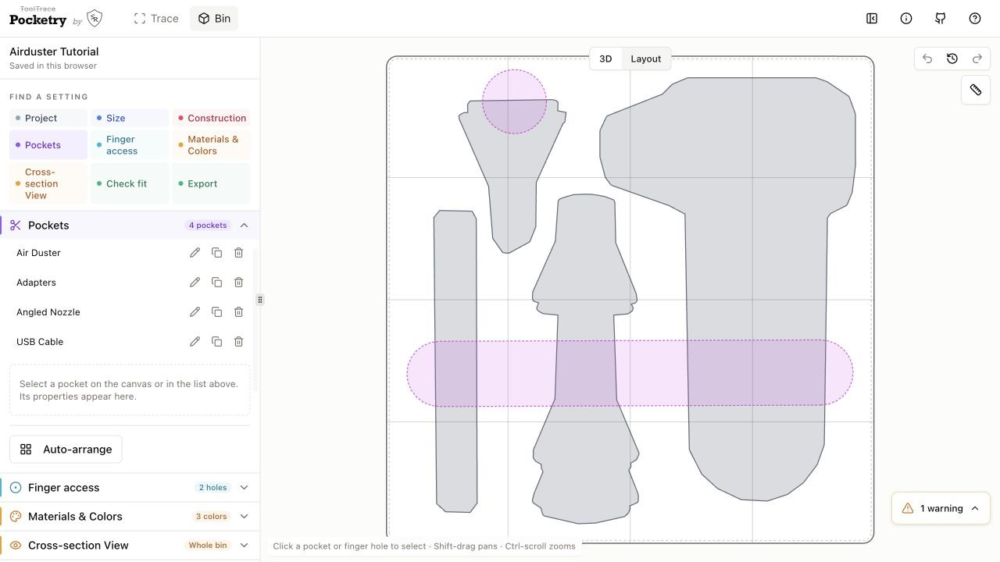

### 3. Check tool shapes and sizes

Use the ruler in Layout to check each outline's length, width, and key features
against measurements of the real tool. Adjust the outline or pocket size until
the shape and dimensions match.

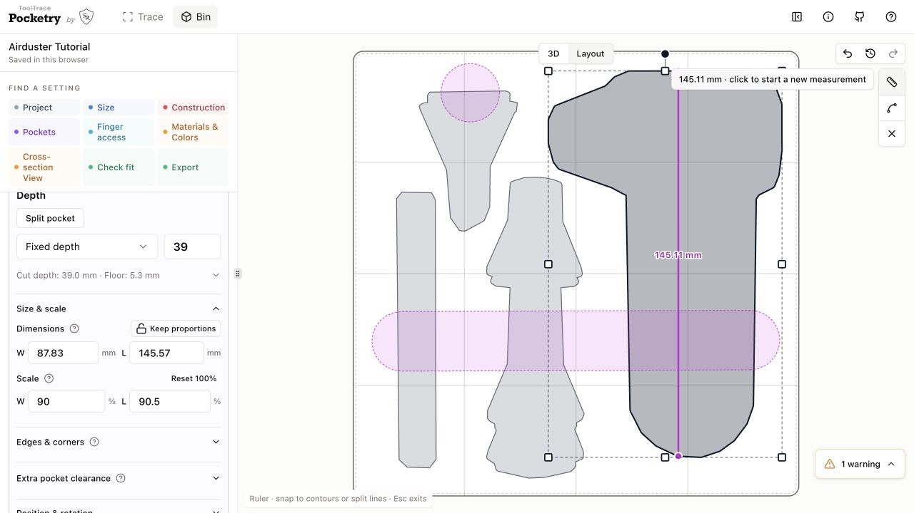

### 4. Print a fit check

Choose **Check fit → Tool outlines** to export thin outlines of the tool pockets.
Open the STL in your slicer at **100% scale**, print it, and try the real tools in
the openings. Adjust the shape, size, or clearance as needed before printing the
full bin.

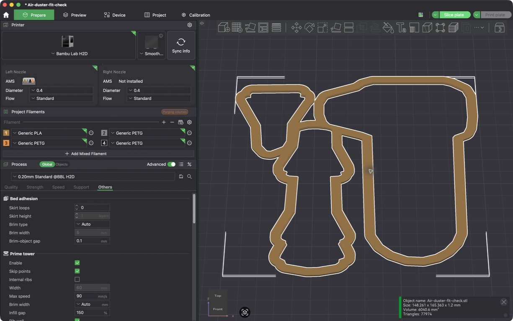

### 5. Export and print the finished bin

Once the fit is verified and pocket depths are checked, export the full bin as
**STL or 3MF**. Open it in your slicer at **100% scale**, choose your material and
print settings, review the layer preview, and print.

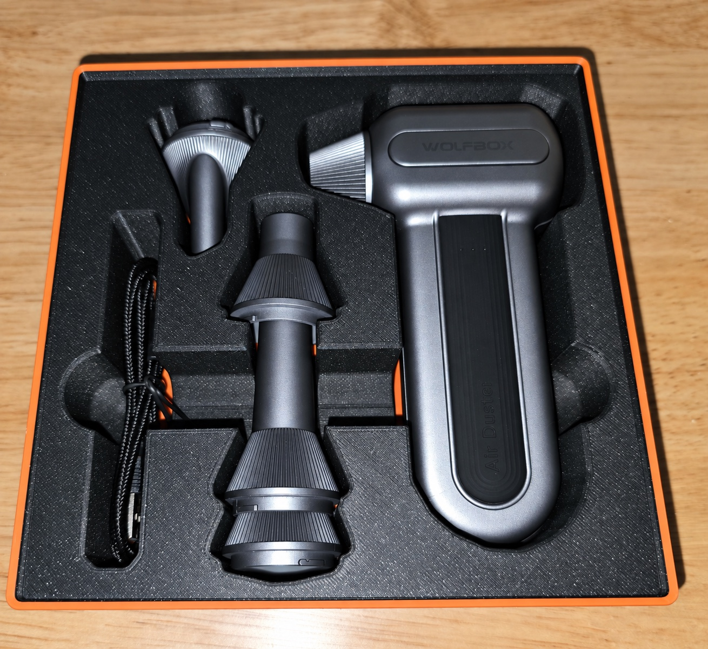

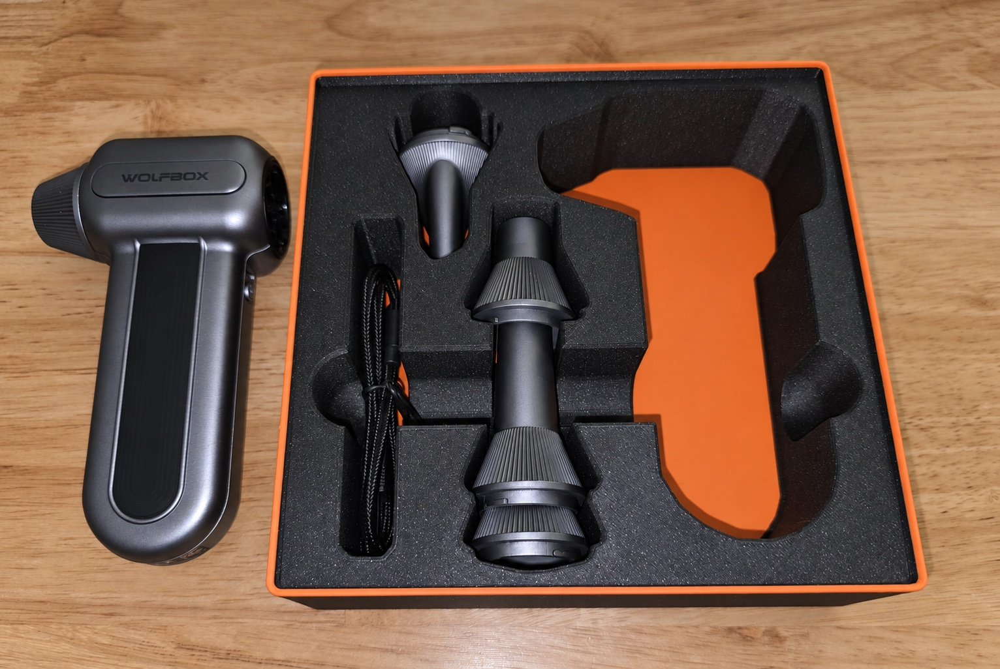

## Privacy

The static application processes images and generates models locally in the
browser. Projects are stored in the browser using IndexedDB. The hosted version
does not require uploading tool photographs to Pocketry's server.

## Run locally

Pocketry requires Node.js 22 and npm.

```sh
npm ci
npm run dev
```

The development server defaults to <http://localhost:5000>. If that port is in
use, choose another one:

```sh
PORT=5001 npm run dev
```

## Verify and build

Run the required type-check and test gate:

```sh
npm run check
npm test
```

Create the production build in `dist/public`:

```sh
npm run build
```

The build includes `LICENSE.txt` and `NOTICE.txt` alongside the application.

## License and attribution

Pocketry's original work is licensed under the
[GNU Affero General Public License v3.0 only](LICENSE). Commercial use is
permitted, but modified distributed versions and modified versions offered over
a network must comply with the AGPL's source-sharing requirements.

Third-party components and adapted source retain their original licenses. Their
licenses, copyright notices, and provenance are recorded in [NOTICE](NOTICE).
The detailed direct-source review is available in
[docs/open-source-review.md](docs/open-source-review.md).

Pocketry was developed with OpenAI Codex.

## Contributing

Issues and pull requests are welcome. Keep changes focused, add or update tests,
run the required verification commands, and update `NOTICE` whenever adding a
direct dependency, bundled artifact, copied component, or adapted source.
