# Pocketry

Pocketry is an open source project that turns photographs of items or tools into
editable outlines, shadow-board files, and printable Gridfinity bins. The
application runs in the browser, with image processing, project storage, and
model generation kept on the user's device.

[Try Pocketry](https://pocketry.xyz) ·
[Sample projects](samples/README.md) ·
[View the source](https://github.com/wcscr/pocketry) ·
[Version history](CHANGELOG.md) ·
[Read the license](LICENSE) ·
[Read third-party notices](NOTICE)

Pocketry's public deployment is [https://pocketry.xyz](https://pocketry.xyz).

## What it does

- Trace and refine outlines from PNG or JPEG photos.
- Calibrate dimensions and correct perspective with printable reference sheets.
- Design Gridfinity or flat bins with custom pockets, finger access, and colors.
- Preview in 3D and export fit checks, STL, or 3MF models.
- Export SVG or DXF files for shadow boards and CNC work.
- Save projects locally, undo changes, and export editable backups.

Check dimensions against the real items and print a fit test before the final bin.

## Sample projects

Browse the [sample projects](samples/README.md) for editable JSONs, 3MF print
models, and photos of finished bins. The collection includes a Wolfbox MF70 Airduster Kit,
DeWalt right-angle tools, a Ryobi cutter, caliper storage, a stapler, wire
strippers, a Klein voltage tester, a Citadel mouldline remover, Wiha drivers with 40, 50, 60, and 150 mm blades, a mini socket set, and individual and combined Bessey Utility Knife and Gerber Multitool bins.

[Download the complete sample library](samples/pocketry-sample-library.json)
to import all 16 designs at once.

| **[Wolfbox MF70 Airduster Kit](samples/wolfbox-mf70-airduster-kit/)** | **[DeWalt right-angle tools](samples/dewalt-right-angle-tools/)** |
| :---: | :---: |
| <a href="samples/wolfbox-mf70-airduster-kit/"></a> | <a href="samples/dewalt-right-angle-tools/">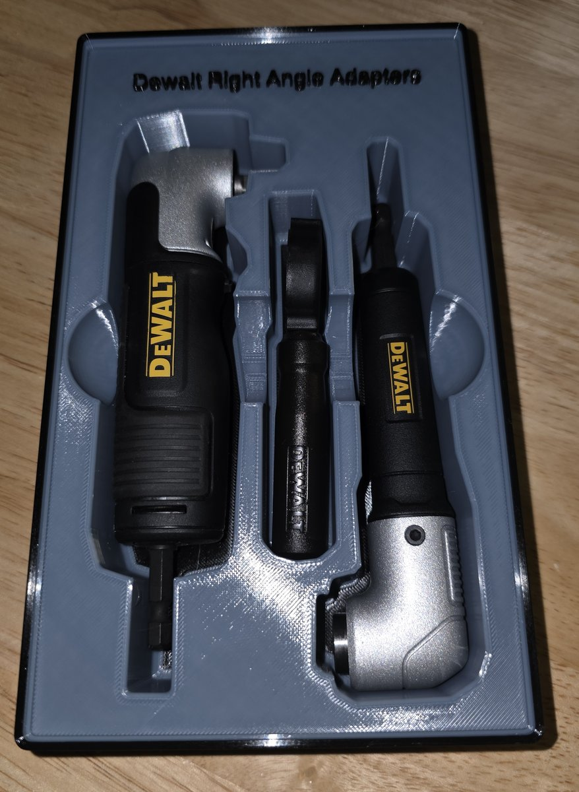</a> |
| **[Ryobi cutter](samples/ryobi-cutter/)** | **[Wire strippers](samples/wire-strippers/)** |
| <a href="samples/ryobi-cutter/">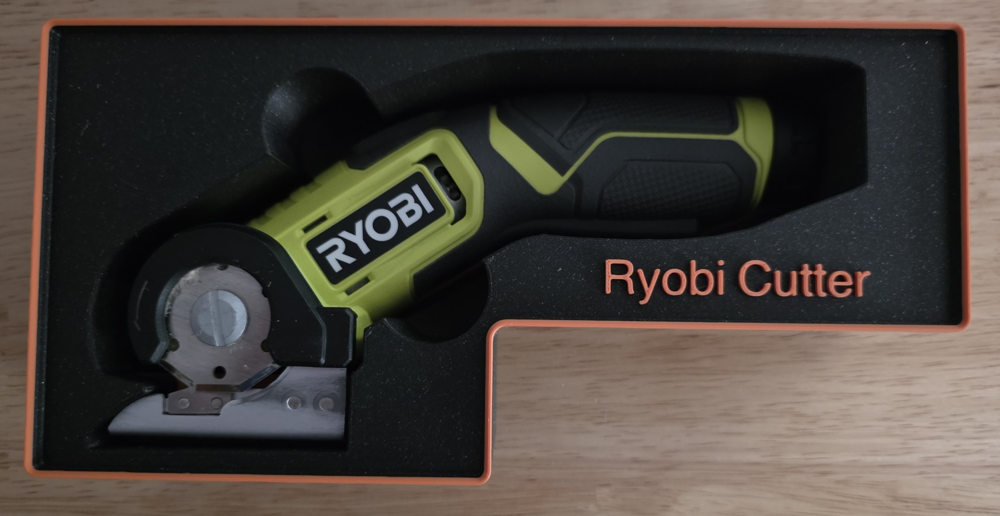</a> | <a href="samples/wire-strippers/">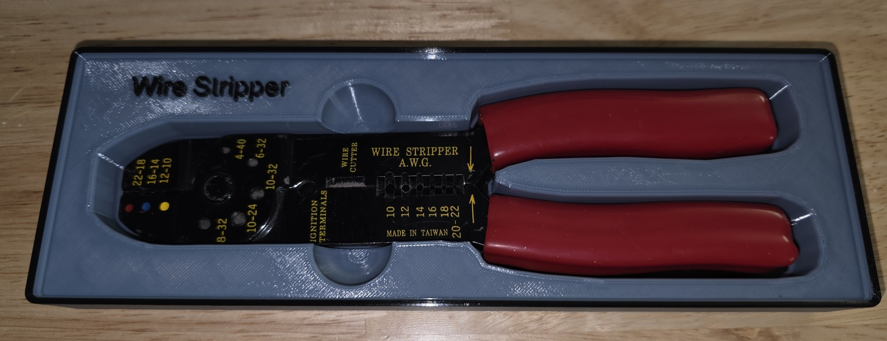</a> |
| **[Caliper storage](samples/caliper-storage/)** | **[Stapler](samples/stapler/)** |
| <a href="samples/caliper-storage/">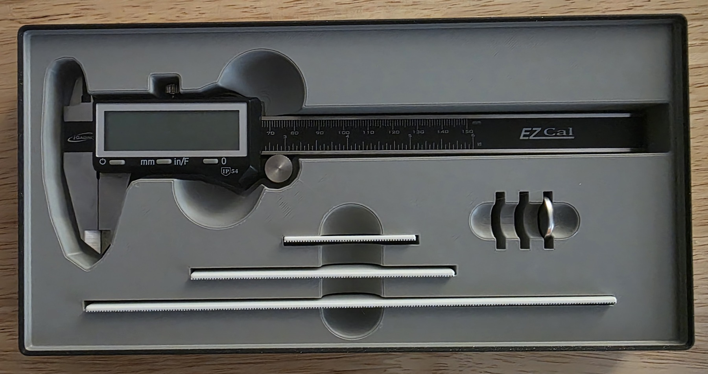</a> | <a href="samples/stapler/">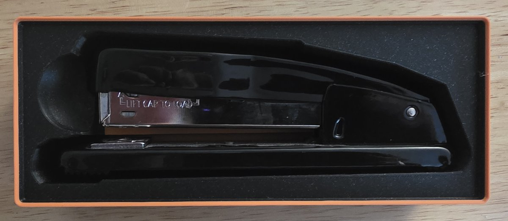</a> |
| **[Klein voltage tester](samples/klein-voltage-tester/)** | **[Citadel mouldline remover](samples/mouldline-remover/)** |
| <a href="samples/klein-voltage-tester/">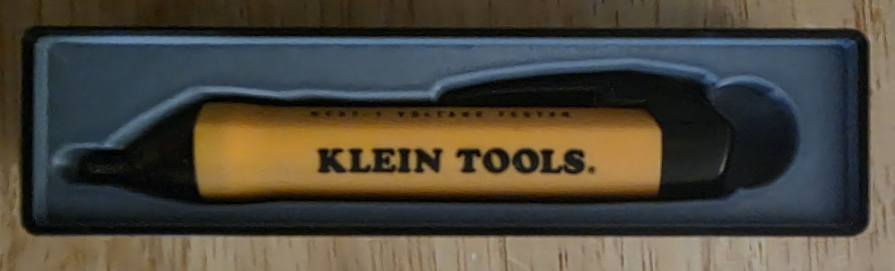</a> | <a href="samples/mouldline-remover/">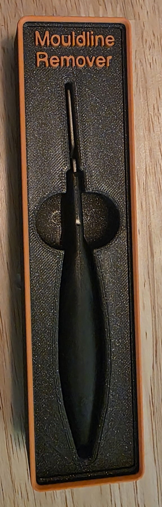</a> |
| **[Wiha 150 mm drivers](samples/wiha-drivers/)** | **[Mini socket set](samples/mini-socket-set/)** |
| <a href="samples/wiha-drivers/">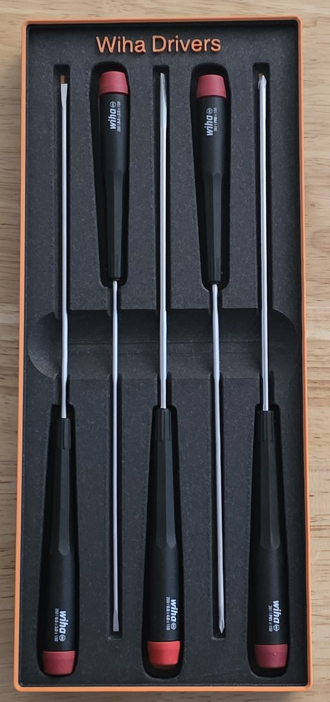</a> | <a href="samples/mini-socket-set/">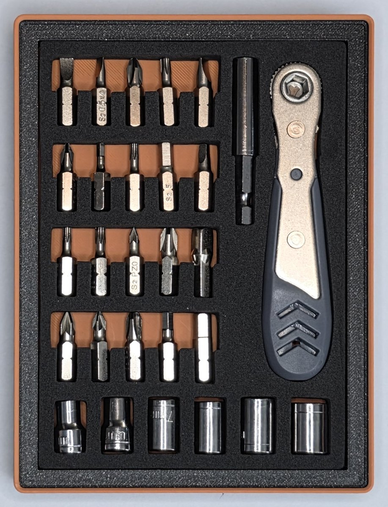</a> |
| **[Wiha 40 mm drivers](samples/wiha-40mm-drivers/)** | **[Wiha 50 mm drivers](samples/wiha-50mm-drivers/)** |
| <a href="samples/wiha-40mm-drivers/">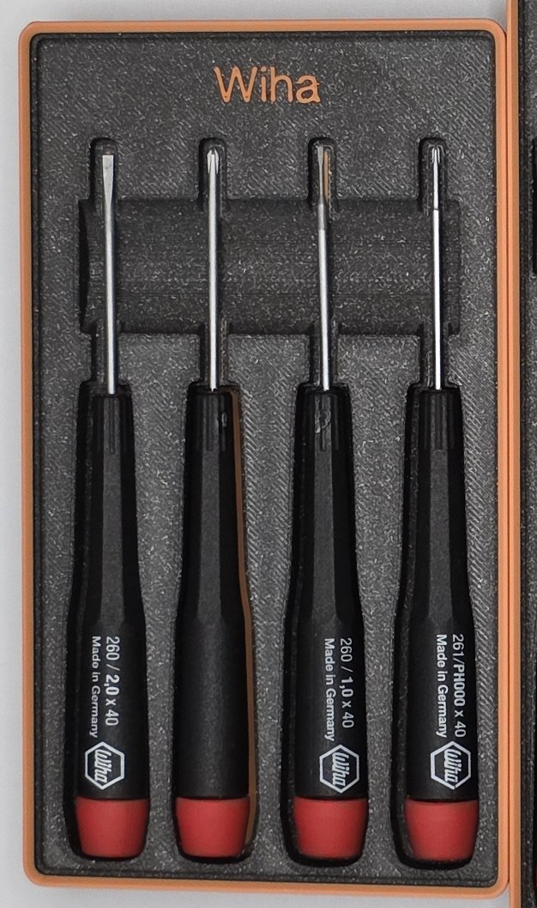</a> | <a href="samples/wiha-50mm-drivers/">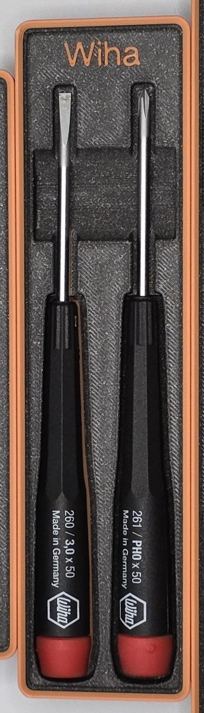</a> |
| **[Wiha 60 mm drivers](samples/wiha-60mm-drivers/)** | **[Wiha bins stacked in a drawer](samples/README.md#print-photos)** |
| <a href="samples/wiha-60mm-drivers/">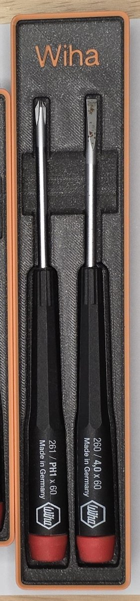</a> | <a href="samples/wiha-drivers/photos/stacked-bins-in-drawer.jpg">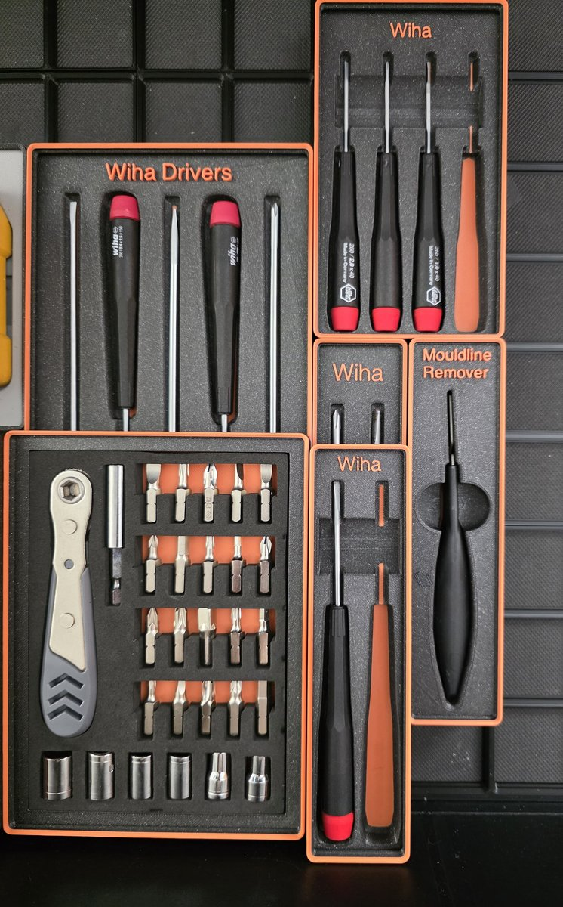</a> |
| **[Bessey Utility Knife](samples/bessey-utility-knife/)** | **[Gerber Multitool](samples/gerber-multitool/)** |
| <a href="samples/bessey-utility-knife/">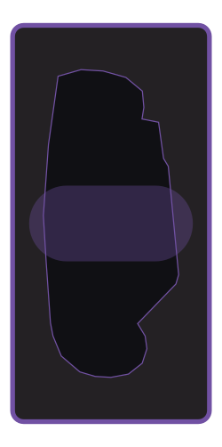</a> | <a href="samples/gerber-multitool/">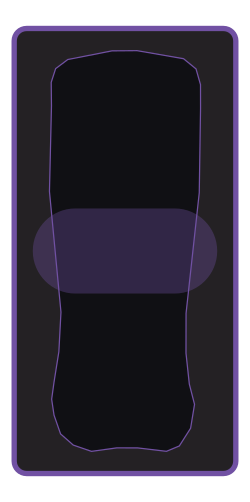</a> |
| **[Bessey and Gerber combined bin](samples/bessey-gerber/)** | **[All sample projects](samples/README.md)** |
| <a href="samples/bessey-gerber/"></a> | [Download the complete editable library](samples/pocketry-sample-library.json) |

The Wiha drivers sit slightly too high to stack the loaded bins without some
interference. If stacking is desired, lower the driver pockets by about **1 mm**
in the editable project before exporting a revised print model.

We'd love to see what you make with Pocketry! If you share a design on MakerWorld,
Printables, or elsewhere, please give Pocketry a shout-out and link to
[pocketry.xyz](https://pocketry.xyz).

## Basic Process

### 1. Trace and refine the outline

Import a photograph, calibrate its scale, and edit the detected outline to follow
the tool's shape.

For a manual scale, place the ruler endpoints on a known feature, enter its
length, then press Enter or **Confirm scale**. **Simplification** controls point
count: higher values use fewer points and can lose small details. Physical Trace
exports require a confirmed scale and show the resulting dimensions before
download; an unscaled outline can still be exported as an SVG in pixels.

The current Trace draft is saved in this browser, including its photo, scale,
edited contours, and undo history. Wait for **Trace draft saved in this browser** before
closing the page. This recovery copy is local to the browser; replacing the photo
or choosing **Start over** replaces or clears it. Export a project backup for a
portable copy of a calibrated outline and its bin settings.


### 2. Arrange the pockets

Move the tool outlines into a Gridfinity bin, arrange the duster and accessories,
and add finger access for lifting them out.

Multi-selection, Move, Rotate, alignment, and distribution are standard in both
layouts. **Add** stays first in the canvas toolbar; narrower spaces put additional
tools under **Tools**. Phones offer **Workflow**, **Adjust**, and **Export**.
Selection updates the summary without opening Adjust; **All properties** opens
the complete editor. New sessions without a saved layout use Workflow + properties
at 1100 × 600 px or larger, and Single panel on smaller screens. Resizing adapts
the workspace while retaining that session's choice. Choose **Single panel** or
**Workflow + properties** in **App settings**.

Turn on **App settings → Enable experimental features**, then use
**Surface text → Add text** for raised labels on the flat interior surface
(the floor of a hollow bin, or the top of its solid fill). Adding text opens
Layout so you can drag the label into place, even if its starting position
overlaps a pocket. **Position text in Layout** returns existing labels to this
view after a preview error. Set the wording, font, size, raised height, and
rotation; use X/Y coordinates or drag the label. Keep every letter clear of pockets, openings, other labels, and
the perimeter. **Text color** applies to every label in the project and matches
the edge band by default. Choose a custom color or return to **Use edge-band color**.

The 11 bundled font choices are Sans and Sans Bold, Serif and Serif Bold,
Monospace, Helvetiker and Helvetiker Bold, Optimer and Optimer Bold, and
Gentilis and Gentilis Bold.

Turning experimental features off hides text editing and disables label dragging;
existing labels remain visible, saved, and included in exports. Loading projects
and undo history never changes that preference. A notice offers explicit opt-in
when the current design contains experimental features. Shared linked geometry
requires opt-in; independent placement, naming, deletion, and independent copies
remain available. Adjustable walls, text, fonts, and linked designs remain experimental.

Numeric fields preview valid changes immediately. Enter or leaving the field
commits once; Escape restores the whole edit, including dependent geometry.
Invalid Enter keeps focus; invalid blur discards the edit. Batch fields still use
**Apply**. Autosave and export use committed changes. An unnamed draft is separate
from named Library storage; choose **Save this draft to Library** to name it.


### 3. Check tool shapes and sizes

Use the ruler in Layout to check each outline's length, width, and key features
against measurements of the real tool. Adjust the outline or pocket size until
the shape and dimensions match.


### 4. Print a fit check

Choose **Check fit → Tool outlines** to export thin outlines of the tool pockets.
Open the STL in your slicer at **100% scale**, print it, and try the real tools in
the openings. Adjust the shape, size, or clearance as needed before printing the
full bin.


### 5. Export and print the finished bin

Once the fit is verified and pocket depths are checked, export the full bin as
**STL or 3MF**. Open it in your slicer at **100% scale**, choose your material and
print settings, review the layer preview, and print.

**Text labels:** 3MF exports each label as a separate named mesh part, including
in single-color exports. Keep the bin and labels together as one multipart
object when your slicer asks; select a label in the parts list to move, scale,
recolor, or remove it. Choose **Multi-color 3MF** to preserve the shared text
color; **Single-color 3MF** uses the bin color for all parts. The text color is saved
with the project and supports undo/redo. Change wording in Pocketry and export again. STL fuses
the text into the bin. The bundled fonts travel as mesh geometry,
so slicers do not need them installed.

Text projects use schema 28 and require this version of Pocketry to reopen.
Existing schema-26 projects migrate with no labels; undo history is preserved.


## Privacy

The static application processes images and generates models locally in the
browser. Projects are stored in the browser using IndexedDB. The hosted version
does not require uploading tool photographs to Pocketry's server.

## Run locally

Pocketry requires Node.js 22 and npm.

```sh
npm ci
npm run dev
```

The development server defaults to <http://localhost:5000>. If that port is in
use, choose another one:

```sh
PORT=5001 npm run dev
```

## Verify and build

Run the required type-check and test gate:

```sh
npm run check
npm test
```

Create the production build in `dist/public`:

```sh
npm run build
```

The build includes `LICENSE.txt` and `NOTICE.txt` alongside the application.

## Versions and update history

About displays the version from `package.json`; [CHANGELOG.md](CHANGELOG.md)
tracks notable updates. Keep entries to a few short bullets per version.

For releases, use `npm version patch --no-git-tag-version` (or `minor` for new
features, `major` for breaking changes), then date the matching changelog entry.
Commit both package files and the changelog together after verification.

## License and attribution

Pocketry's original work is licensed under the
[GNU Affero General Public License v3.0 only](LICENSE). Commercial use is
permitted, but modified distributed versions and modified versions offered over
a network must comply with the AGPL's source-sharing requirements.

Third-party components and adapted source retain their original licenses. Their
licenses, copyright notices, and provenance are recorded in [NOTICE](NOTICE).
The detailed direct-source review is available in
[docs/open-source-review.md](docs/open-source-review.md).

## Contributors

Pocketry is developed and maintained by Sugarcreek Research, LLC.
[OpenAI Codex](https://openai.com/codex/) is an AI contributor to the project,
assisting with implementation, testing, documentation, and code review. This
acknowledgment includes work not individually credited in the commit history.

## Contributing

Issues and pull requests are welcome. Keep changes focused, add or update tests,
run the required verification commands, and update `NOTICE` whenever adding a
direct dependency, bundled artifact, copied component, or adapted source.
