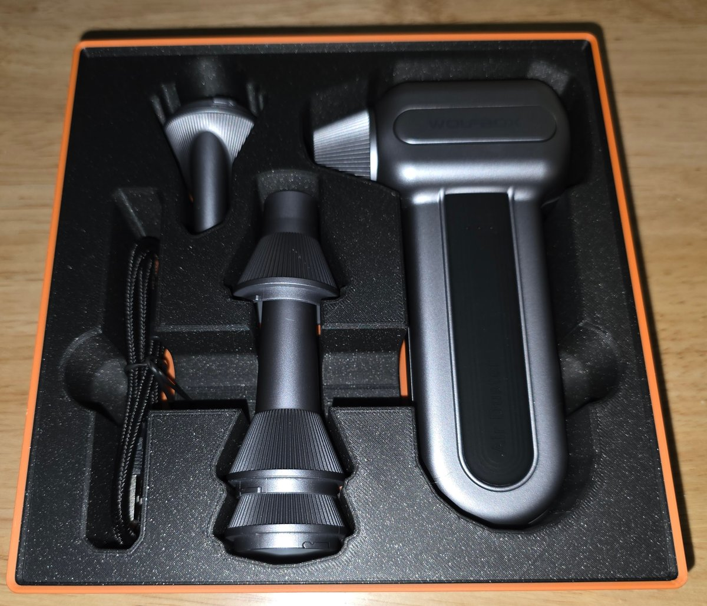
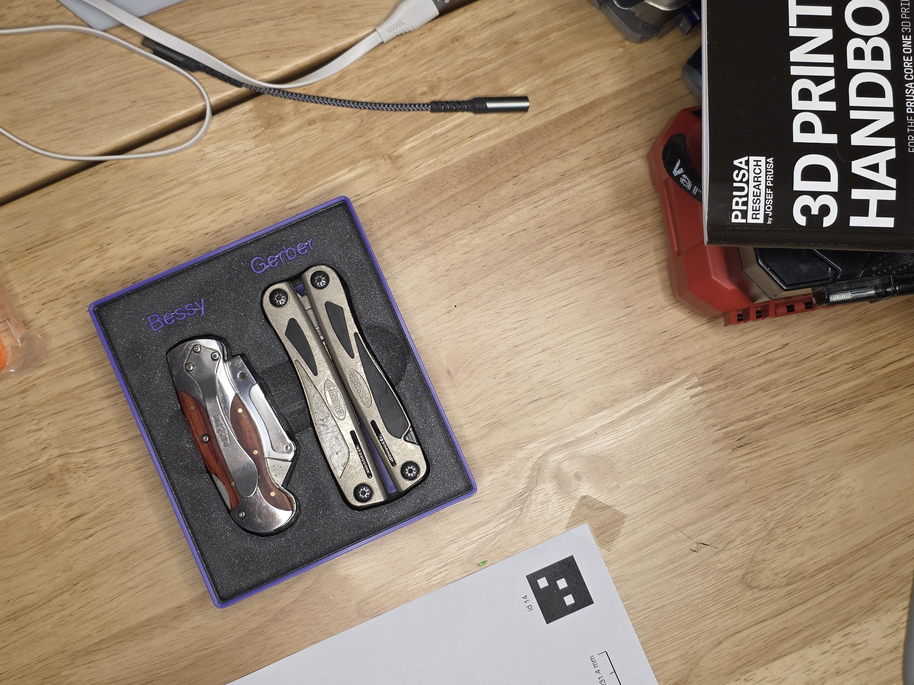
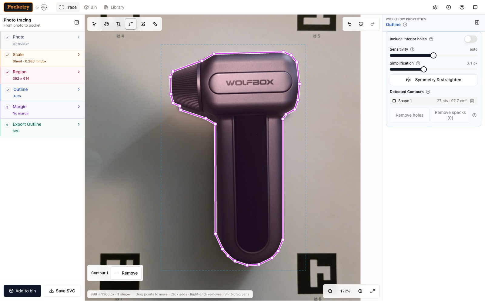
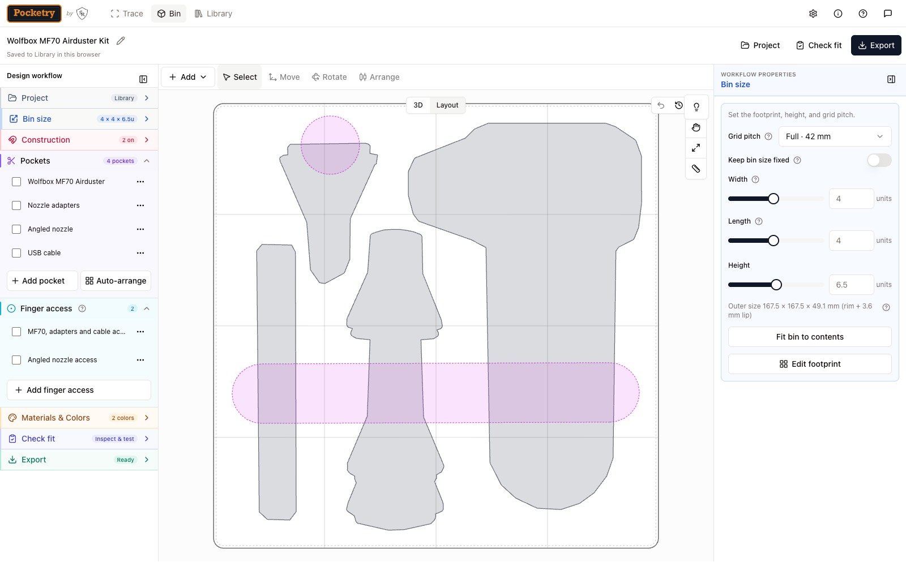
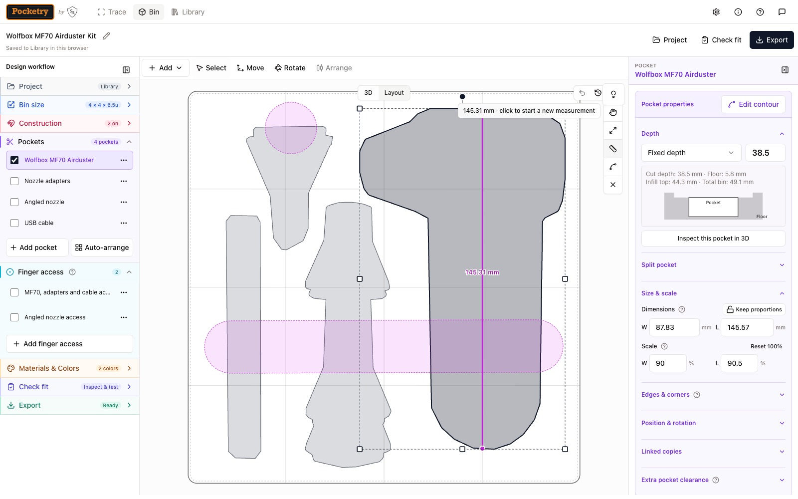
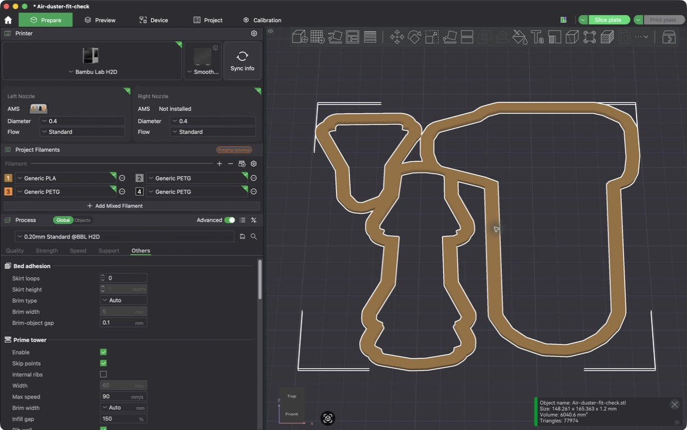
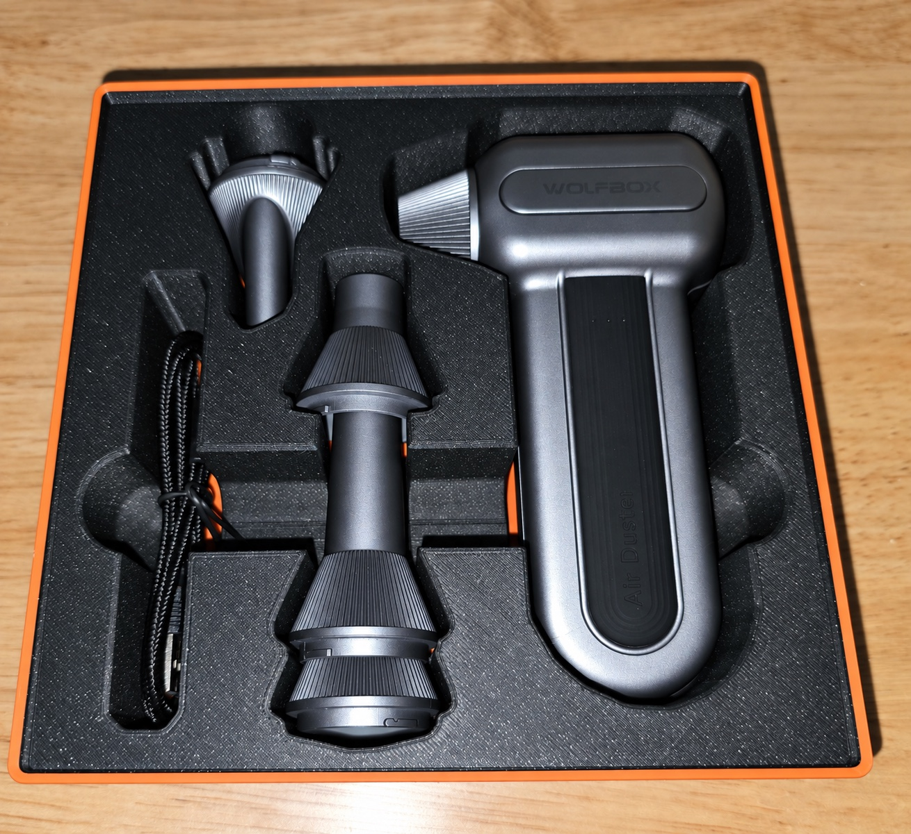
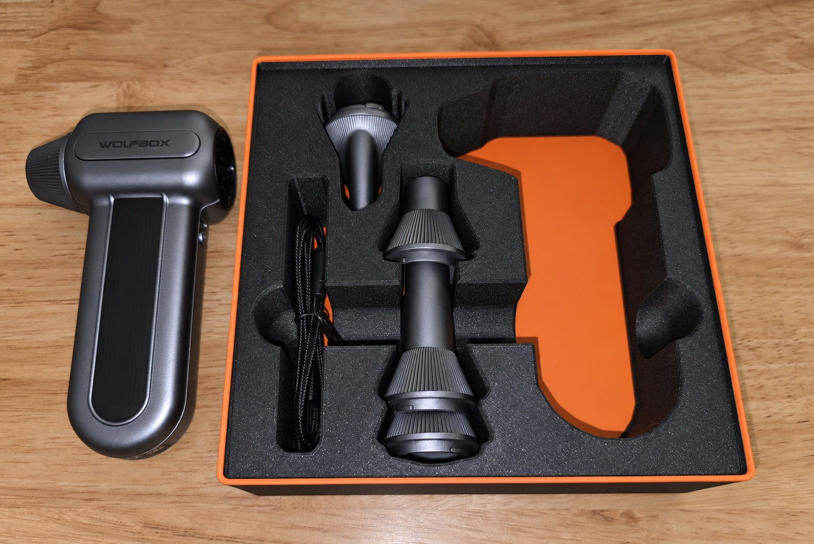

# Pocketry

Pocketry is an open source project that turns photographs of items or tools into
editable outlines, shadow-board files, and printable bins with Gridfinity or
flat bottoms. The application runs in the browser, with image processing,
project storage, and model generation kept on the user's device.

[Try Pocketry](https://pocketry.xyz) ·
[Sample projects](samples/README.md) ·
[View the source](https://github.com/wcscr/pocketry) ·
[Version history](CHANGELOG.md) ·
[Read the license](LICENSE) ·
[Read third-party notices](NOTICE)

Pocketry's public deployment is [https://pocketry.xyz](https://pocketry.xyz).

## What it does

- Trace and refine outlines from PNG or JPEG photos.
- Calibrate dimensions and correct perspective with printable reference sheets.
- Design Gridfinity or standalone flat-bottomed bins with custom pockets, finger access, and colors.
- Create 3D-printable positioning jigs for laser engraving and UV printing, including eufyMake setups.
- Preview in 3D and export fit checks, STL, or 3MF models.
- Export SVG or DXF files for shadow boards and CNC work.
- Save projects locally, undo changes, and export editable backups.

Check dimensions against the real items and print a fit test before the final bin.

## About Gridfinity

Gridfinity is a modular, 3D-printable storage system created by
[Zack Freedman](https://www.youtube.com/c/ZackFreedman). Its bins and holders fit
a shared baseplate grid, so you can rearrange and expand your storage as your
collection grows. Pocketry builds on that system by turning tool photos into
custom Gridfinity bins. It also supports standalone flat-bottomed bins for
use directly in a drawer or on a worktop, with no Gridfinity baseplate needed.

Watch Zack's [original Gridfinity introduction](https://www.youtube.com/watch?v=ra_9zU-mnl8)
and browse [his original designs on Thangs](https://thangs.com/designer/ZackFreedman).

## Sample projects

All of these sample projects are real designs that have been physically printed.
Browse the [sample projects](samples/README.md) for editable designs, printable
3MFs, and photos. Each project page includes its downloads, dimensions, and any
fit or stacking notes.

| [Wolfbox MF70 Airduster Kit](samples/wolfbox-mf70-airduster-kit/) | [Bessey and Gerber](samples/bessey-gerber/) |
| :---: | :---: |
| <a href="samples/wolfbox-mf70-airduster-kit/"></a> | <a href="samples/bessey-gerber/"></a> |

**[Browse all examples and download the editable library →](samples/README.md)**

We'd love to see what you make with Pocketry! If you share a design on MakerWorld,
Printables, or elsewhere, please give Pocketry a shout-out and link to
[pocketry.xyz](https://pocketry.xyz).

## Basic Process

### Find your way around

Use **Trace** to turn a photo into an outline, **Bin** to design the bin, and
**Library** to reopen saved designs. On a phone, these are in the workspace menu
at the top of the screen.

On desktop, **Workflow + properties** is the default for new sessions with no
saved layout choice. Choose a workflow step on the left; its controls appear on
the right, with the canvas in the middle. Selecting a pocket or finger access
shows that object's properties. Smaller screens start with a single panel.
To change layouts, open **App settings → Editor layout** and choose
**Workflow + properties** or **Original Single Panel UI**. Your choice is remembered.

In **Bin** on a phone, use **Workflow** to find a section, **Adjust** for quick
changes, and **All properties** for the full editor. **Select**, **Move**, and
**Rotate** stay beside the canvas; their adjustments appear below or beside it.
**Done** returns to selection. **Export** opens the export controls.
App settings and Help are in **More options**.

### 1. Trace the tools

This walkthrough uses the [Wolfbox MF70 Airduster Kit](samples/wolfbox-mf70-airduster-kit/).
The Trace image demonstrates outlining the original duster photo. The layout
and ruler images show the supplied editable project for the printed bin.

In **Trace**, choose a PNG or JPEG taken from above, with the whole tool visible
against a contrasting background. Include a known measurement at the tool's
height, or use one of the downloadable calibration aids.

In **Scale**, review the reference detection. For a detected calibration sheet,
choose **Correct perspective & use scale**; other detected references offer
**Accept detected scale**. For manual calibration, choose **Set scale**, place
the ruler endpoints a known distance apart, enter that distance in millimetres,
and choose **Confirm scale**. If perspective correction crops a larger tool,
enable **Region → Show full corrected photo**.

Choose **Region → Set region** and draw a box around the tool. In **Outline**,
adjust **Sensitivity** to refine detection and **Simplification** to control the
number of points. Use **Edit contours** to correct individual points, or
**Symmetry & straighten** when the tool needs a symmetric outline or upright alignment.
**Margin** optionally adds clearance around the traced tool.

**Select** only selects contours. Choose **Edit contours** to move points or add
one near an edge; clicking empty space clears the selection. Ctrl/Cmd+Z and
Ctrl/Cmd+Shift+Z undo and redo contour edits, including after toolbar clicks.
Replacing a ruler keeps the accepted scale until you confirm the new one;
**Cancel ruler** restores it. Clearing the region or redrawing it over manual
edits asks before replacing your work. Clearing the region also clears contour
history and cannot be undone.

The current Trace draft is saved in this browser, including its photo, scale,
edited contours, and undo history. Wait for **Trace draft saved in this browser** before
closing the page. This recovery copy is local to the browser; replacing the photo
or choosing **Start over** replaces or clears it. Export a project backup for a
portable copy of a calibrated outline and its bin settings.

Choose **New trace** in the Photo step (or **Start over** in the phone menu) to
begin again. Confirming clears the current trace and its edit history; pockets
already added to Bin remain. Photo selection accepts one PNG, JPG, or WebP up to
10 MB. Rejected or unreadable photos show a persistent message and leave the
current trace intact. If no outline is found, increase **Sensitivity** or redraw
the region around the whole tool.

Choose **Add to bin**, name each tool, and choose its depth before continuing.
For **Fixed depth**, enter **Pocket depth (mm)**: how far the tool should sit below
the bin surface, leaving enough exposed to lift it out. Depth starts blank so it
is always your choice. **To Floor** extends the pocket to the destination bin’s
default floor: 7 mm above the underside for Gridfinity or 2 mm for a flat-bottom bin.
For a jig supported by the work surface, explicitly choose **Through — no pocket
floor** instead. Grouped outlines share one depth. Choices survive the handoff
and reload, and become ordinary editable pocket depths. Bin height stays
unchanged; a depth that exceeds it blocks 3D export until corrected.

Use **Add and trace another photo** for the accessories, then **Add and arrange**
when the traces are ready. For a
standalone outline, **Export Outline** offers SVG, DXF, and STL. Confirm the scale
before exporting files for printing or cutting.



### 2. Arrange the pockets

In **Bin**, choose **Bin size** to set the footprint, height, and grid pitch.
This example uses **4 × 4 cells** and **6.5u** height. Enable **Keep bin size fixed**
to keep that footprint while arranging the tools. Use **Construction** for the
base, rim, and solid fill height, and **Materials & Colors** for colors. Solid
fill height sets the pocketed surface; it is separate from slicer infill.

For a standalone bin with a smooth underside, turn on
**Construction → Flat bottom**. This removes the Gridfinity base. **Stacking lip**
is a separate option in the same section; turn it off if you do not need the rim.
The tracing, pocket editing, and export workflow stays the same for either base.

Use custom pockets to hold parts in repeatable positions during engraving or
printing. For flat-bottomed positioning jigs, consider **Through** under a
pocket's **Depth** settings to save filament. The parts rest directly on the
work surface while the pocket walls hold them in position. Keep a pocket floor
when the jig needs to support the parts, set their height, or carry them between
work areas.

Switch to **Layout** for a top-down view. Drag pockets into place, or select one
and use **Move** or **Rotate**. Use **Add** for extra pockets, or
**Add finger access** for lifting scoops such as the shared slot and round
nozzle access shown below.

Select a pocket on the canvas or in **Pockets**, then edit **Depth**,
**Size & scale**, **Edges & corners**, or **Position & rotation** in its
properties. Select several objects with their checkboxes or Shift/Ctrl/⌘-click
to move or arrange them together. Additional toolbar actions appear under
**Tools** when space is limited.

Numeric fields preview valid changes immediately. Enter or leaving the field
commits once; Escape restores the whole edit, including dependent geometry.
Invalid Enter keeps focus; invalid blur discards the edit. Batch fields still use
**Apply**. Autosave and export use committed changes. An unnamed draft is separate
from named Library storage; choose **Save this draft to Library** to name it.

Bin projects are also saved only in this browser. If another tab changes the
saved projects, a stale tab stops saving and shows a notice above the canvas.
Use **Download backup** to keep that tab's edits, then reload to use the latest
saved work. Storage errors keep the same backup action visible even when the
controls are closed. A failed library read is shown as an error, not an empty
library.

**New project** offers to save an unnamed draft with a name before starting over.
Saving the draft and starting the empty project succeed together; a storage or
name-conflict error keeps your draft open. Discarding the draft is a separate,
explicit choice. Named projects save their latest changes before starting new.
Projects saved by a newer version, or ones this version cannot read, remain
visible in the library and included in **Export library** backups. Their Open,
Rename, and Copy actions stay disabled to preserve the saved document.



### 3. Check tool shapes and sizes

Use **Measure between contours** in Layout to compare the outlines with
measurements of the real tools. Select a pocket and open **Size & scale** to
adjust its width and length. Keep proportions linked for a uniform correction,
or unlock them when the two dimensions need different corrections. A ruler
reading between two contour points can differ from the overall bounding size.

Measure pocket depths too. Check the remaining floor in **3D**, or use
**Check fit → Inspect inside** for a cross-section. Pockets can overlap to form
a shared opening; review any warnings before printing.



### 4. Print a fit check

Open **Check fit**. Under **Prepare fit test templates**, choose **Full surface**
or **Tool outlines**. We recommend a thickness of **0.6–0.8 mm** for fit checks.
Choose **Save surface fit test STL**, print at **100% scale**, and try the real
tools. Adjust the outline, scale, or clearance as needed. These thin templates
check the surface openings; they do not test pocket depth or baseplate fit.

The original slicer screenshot below shows an earlier **1.2 mm** fit check.



### 5. Export and print the finished bin

When the fit and depths are right, open **Export** and choose **Save 3MF** or
**Save STL**. Choose **Multi-color 3MF** to keep your selected material colors.
Open the file in your slicer at **100% scale**, choose filament and print
settings, and review the layer preview before printing. SVG and DXF bin layouts
are also available for shadow boards and CNC work.





### Save an editable copy

In **Project**, choose **Save this draft to Library** to name an unnamed draft.
Named projects save changes in this browser; reopen them from **Library**.
**Export project** downloads an editable `.pocketry.json` backup, including the
project's colors. **Open project** restores a downloaded design to the browser
library. A printable STL or 3MF is separate from this editable project.

The current Trace draft also saves locally, including its photo, scale, contours,
and undo history. Wait for **Trace draft saved in this browser** before closing
the page. Replacing the photo or choosing **Start over** replaces or clears that
recovery copy. Keep exported project backups for designs you want to move to
another browser or device.

Optional tools such as surface text, adjustable empty-bin walls, and linked
designs are under **App settings → Enable experimental features**. The basic
workflow above does not require them. Opening a project keeps your preference;
existing experimental geometry stays visible and exportable.

## Privacy

The static application processes images and generates models locally in the
browser. Projects are stored in the browser using IndexedDB. The hosted version
does not require uploading tool photographs to Pocketry's server.

## Run locally

Pocketry requires Node.js 22 and npm.

```sh
npm ci
npm run dev
```

The development server defaults to <http://localhost:5000>. If that port is in
use, choose another one:

```sh
PORT=5001 npm run dev
```

## Verify and build

Run the required type-check and test gate:

```sh
npm run check
npm test
```

Create the production build in `dist/public`:

```sh
npm run build
```

The build includes `LICENSE.txt` and `NOTICE.txt` alongside the application.

## Versions and update history

About displays the version from `package.json`; [CHANGELOG.md](CHANGELOG.md)
tracks notable updates. Keep entries to a few short bullets per version.

For releases, use `npm version patch --no-git-tag-version` (or `minor` for new
features, `major` for breaking changes), then date the matching changelog entry.
Commit both package files and the changelog together after verification.

## License and attribution

Pocketry's original work is licensed under the
[GNU Affero General Public License v3.0 only](LICENSE). Commercial use is
permitted, but modified distributed versions and modified versions offered over
a network must comply with the AGPL's source-sharing requirements.

Third-party components and adapted source retain their original licenses. Their
licenses, copyright notices, and provenance are recorded in [NOTICE](NOTICE).
The detailed direct-source review is available in
[docs/open-source-review.md](docs/open-source-review.md).

## Contributors

Pocketry is developed and maintained by Sugarcreek Research, LLC.
[OpenAI Codex](https://openai.com/codex/) is an AI contributor to the project,
assisting with implementation, testing, documentation, and code review. This
acknowledgment includes work not individually credited in the commit history.

## Contributing

Issues and pull requests are welcome. Keep changes focused, add or update tests,
run the required verification commands, and update `NOTICE` whenever adding a
direct dependency, bundled artifact, copied component, or adapted source.
