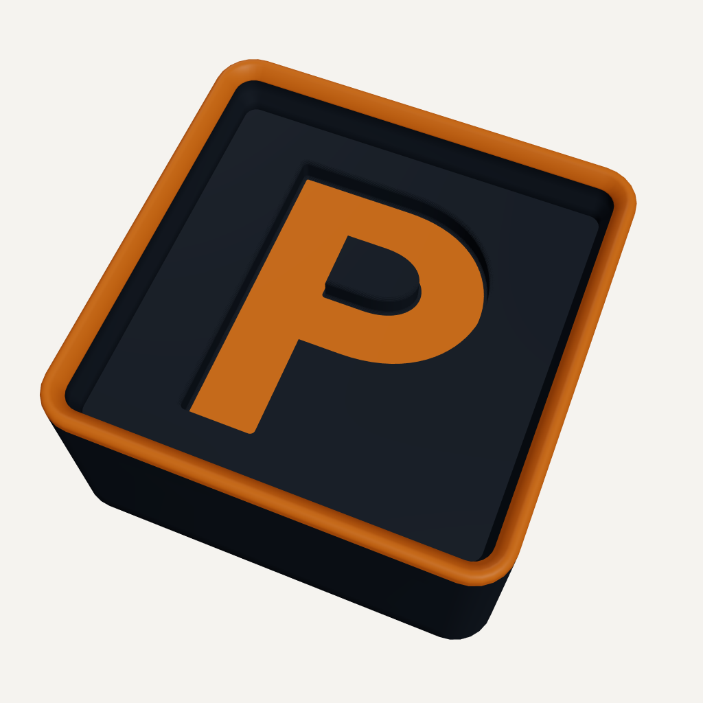
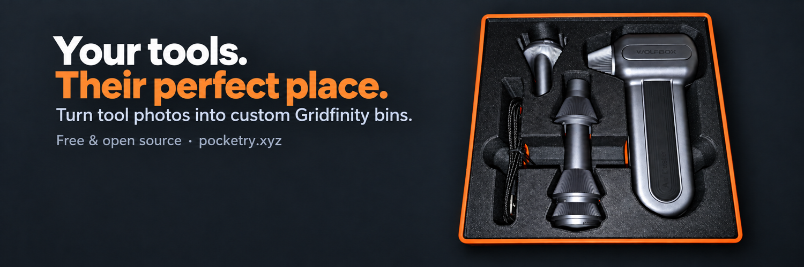

# Pocketry branding

## Icon

The icon is a render of a 1 × 1, 3U-high Gridfinity bin with a recessed orange P
pocket and an orange stacking lip. The letter is an original geometric outline
with a retained island inside its bowl, built through Pocketry's normal pocket
geometry pipeline.

- `pocketry-icon-social.png`: 1024 × 1024, warm-white background, with room
  for a circular profile crop. Use this for the Pocketry X account.
- `pocketry-icon-transparent.png`: 2048 × 2048 transparent master.
- `pocketry-icon.pocketry.json`: editable source; open it using **Bin →
  Project → Open project**.
- `render-settings.json`: material colors, camera, and capture settings.
- `../../client/public/pocketry-icon.png`: 512 × 512 transparent browser icon.
- `../../client/public/favicon.ico`: transparent 16, 32, 48, 64, and 256 px
  frames for browser tabs and bookmarks.

The icon images were captured from the application's actual `BinViewport` scene
in an isolated headless browser. Capture hides the reference grid and uses
the camera in `render-settings.json`; the app's lighting and materials are
otherwise unchanged. Smaller images are resampled from that render.

The project file preserves the geometry. Material colors and camera position
are view settings, so apply the values in `render-settings.json` after opening
the project when reproducing the icon.

## X header

- `pocketry-x-header.png`: 1500 × 500 PNG, ready for the X profile header.
- `pocketry-x-header-prompts.md`: initial composition and layout-refinement prompts.

The header combines the contributor-supplied photograph at
`../images/printed-bin-loaded.jpg` with a charcoal background and orange/white
type using OpenAI's built-in ImageGen tool. It is an AI-edited photographic
composition, not an unmodified photograph or application render. The lower-left
area is clear to accommodate the overlapping profile picture. The generated
2172 × 724 image was resampled to 1500 × 500 with macOS `sips`.

These assets use the project's AGPL-3.0-only licence. Product names and marks
retain their respective ownership. See `NOTICE` for provenance.
