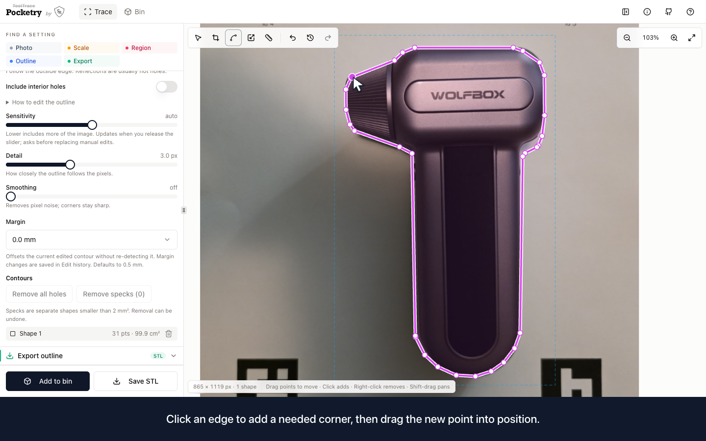
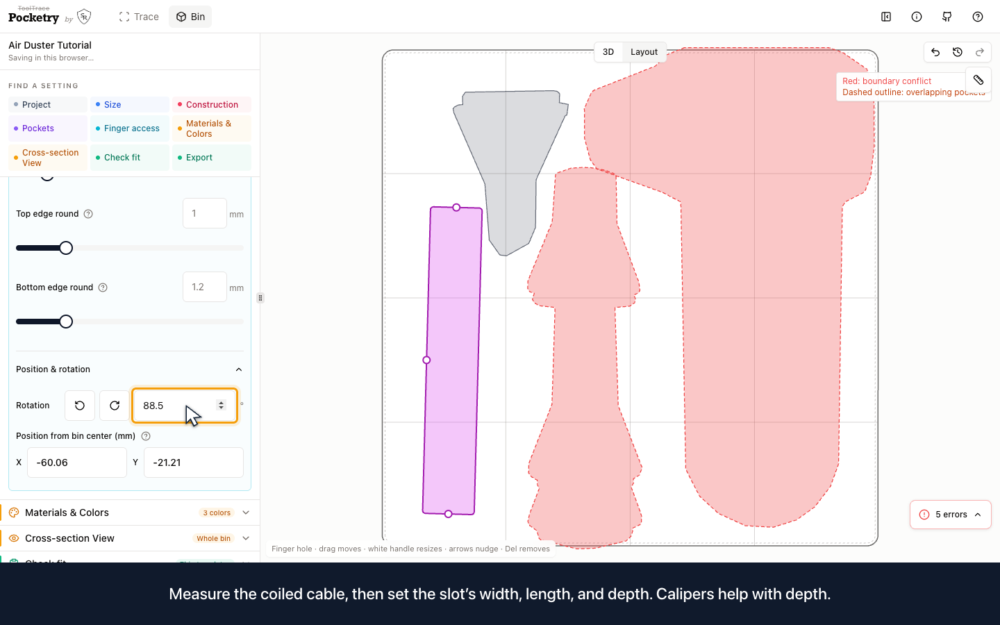
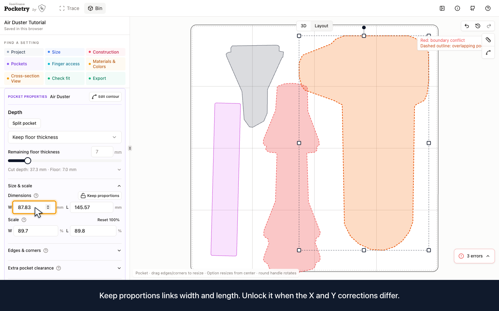
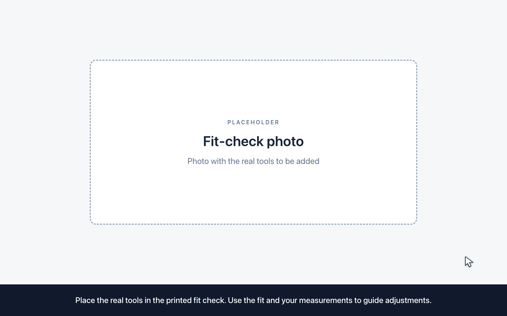
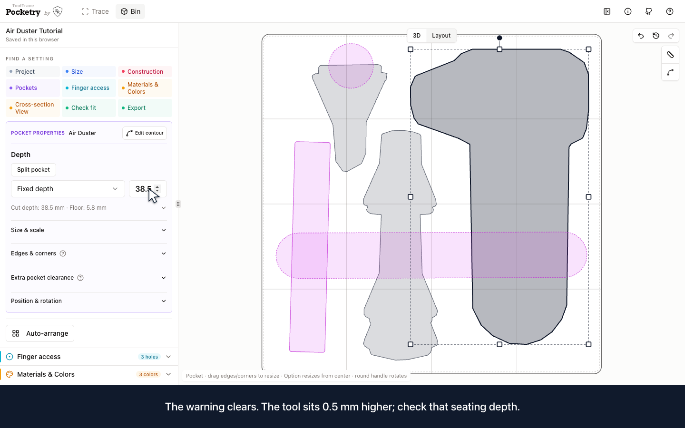
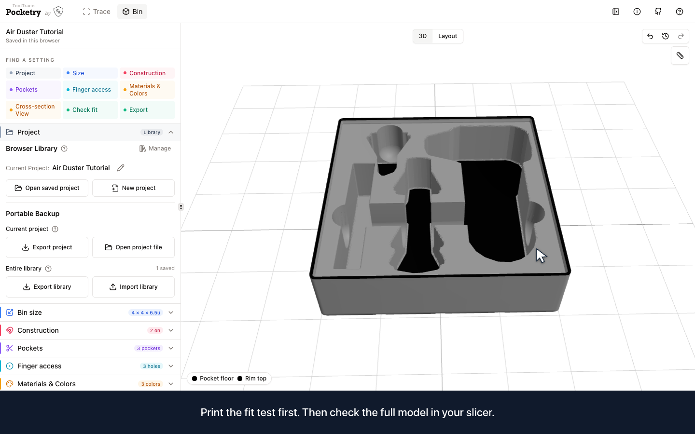

# Air duster: photos to a fitted tool bin

[Watch the tutorial](pocketry-air-duster-tutorial.mp4) · [Captions](pocketry-air-duster-tutorial.srt) · [Chapters](chapters.txt) · [Recording script](RECORDING-SCRIPT.md)

Build a bin from three tool photographs, create a USB cable pocket with **Finger access**, and export a thin fit check before finishing the bin. The 7:05 video is silent, with a visible cursor and American English captions.

## 1. Photograph and trace the tools

Use the [air duster](photos/air-duster.jpg), [adapters](photos/adapter-stack.jpg), and [angled nozzle](photos/angled-nozzle.jpg) photographs. A printed calibration template makes scaling easier. Print it at 100% and verify its 100 mm bar.

Correct perspective, select the tool's region, and adjust detection before editing points. Shadows and reflections can distort the outline. Finish each contour in its first editing session: right-click to remove an extra point, drag to move a point, and click an edge to add a corner. Check the shape against the real tool and its measurements.

## 2. Set up the bin and create the cable pocket

Use a 4 × 4 cell footprint and 6.5u height for this example. Arrange the three traced tools and round their pocket edges.

In addition to the photos, create a pocket for the USB cable using **Finger access**. Add a slot, rename it **USB Cable**, choose flat ends and a flat bottom, then set its width, length, depth, rotation, and position from measurements of your coiled cable. No cable photo is needed.

## 3. Measure once and adjust X/Y scale

Measure the real tool with calipers and compare its dimensions with the outline. The video demonstrates three ruler checks on the duster: vertical span, handle width, and head width. A point-to-point ruler reading can differ from the overall bounding size.

Use linked proportions for a uniform correction. Unlock proportions when X and Y need different corrections. Enter your measured overall dimensions and watch the scale percentages update. The dimensions shown in the video are examples for these particular tools:

| Tool | Width × length before rotation |
| --- | --- |
| Air Duster | 87.83 × 145.57 mm |
| Adapters | 36.74 × 113.32 mm |
| Angled Nozzle | 45.43 × 52.75 mm |

## 4. Export the fit check immediately after sizing

Open **Check fit**, choose **Tool outlines**, and export a thin test. This mode checks the three traced tools with less material. Choose **Full surface** to include the USB cable pocket created with Finger access.

Print at **100% scale** and try the real tools. Use the physical fit and your measurements to decide whether to adjust the contour, size, or clearance, then print another fit check if needed.

The photo insert is a clearly labeled placeholder until the real fit-check image is supplied. The recording does not establish physical fit.

## 5. Measure depth and add lifting access

**Adjust pocket depth based on measurements of each real tool. Use calipers for accurate depth measurements.** Choose how much of each tool should remain exposed. A thin fit check tests the opening; pocket depth and seating need separate checks.

Add two curved-bottom finger scoops so the tools can be lifted out. When coloring the pocket floors, inspect any floor-color warning. The example reduces the duster depth from 39 to 38.5 mm, leaving a 5.8 mm floor. The tool will sit 0.5 mm higher, so check that seating depth.

## 6. Inspect and save

Orbit the completed bin and use **Cross-section View** to inspect its floor and depth. Restore the full model before exporting. Once the real tools fit and the depths are checked, save the finished bin and an editable project backup. Inspect the slicer preview before printing.

## Production files

[Production notes](recording/PRODUCTION-NOTES.md) describe the isolated headless recording and replacement workflow. The original take, numbered segments, checkpoints, and actual downloads are retained in `recording/`. Segment 09 contains the replaceable fit-check photo placeholder. [Verification](verification.md) records the checks completed for this revision.
