# Pocketry tutorial: photos to an air duster bin

Trace three photographed tools, refine their contours, arrange a Gridfinity tray, and export a surface fit test and a multi-color 3MF. This walkthrough accompanies the 9 minute 34 second narrated video.

[Watch or download the video](pocketry-air-duster-tutorial.mp4) · [Subtitles](pocketry-air-duster-tutorial.srt) · [Chapter timestamps](chapters.txt)

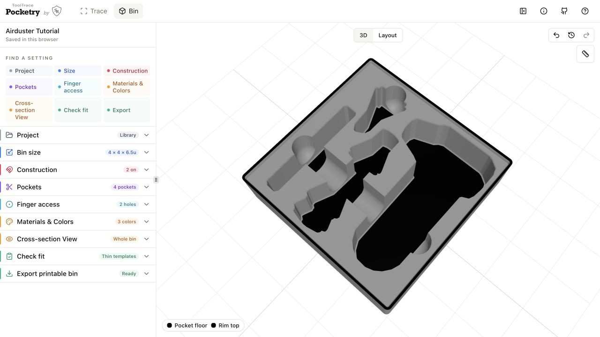

The walkthrough has two parts: first, trace and edit the photographs; then open the supplied editable project to reproduce the **exact reference layout**. New detections and hand edits will not automatically produce the same vertices as the original project. The checkpoint preserves its original geometry so that you can follow the remaining settings exactly.

The screenshots show the actual Pocketry interface. Some show the original camera filenames; use the descriptive photo filenames linked below. Click a screenshot to inspect it at full resolution.

## Files to start with

| File | Use |
| --- | --- |
| [Air duster photo](photos/air-duster.jpg) | Trace the main tool body |
| [Adapter stack photo](photos/adapter-stack.jpg) | Trace the stacked adapters |
| [Angled nozzle photo](photos/angled-nozzle.jpg) | Trace the accessory for the upper-left pocket |
| [Duster and separate nozzle photo](photos/duster-and-nozzle.jpg) | Alternate reference containing two objects |
| [Editable reference project](reference/Airduster-Tutorial.pocketry.json) | Restore the exact outlines, placements and bin settings |

The reference photographs were supplied by Will Cobb. These full-resolution copies have their display orientation applied to the pixels. EXIF, XMP, ICC profiles, MPF/embedded secondary-image metadata, JPEG application segments and comments have been removed. The originals are unchanged.

**Pocket names:** the upper-left accessory is the **Angled Nozzle**. The long, narrow pocket along the left edge is the **USB Cable**. The original project called these “USB Cable” and “Corner Adapters,” respectively; the supplied checkpoint corrects those labels without changing either outline.

## 1. Import the air duster photo

1. Open **Trace**.
2. Choose **Choose File** and select `air-duster.jpg`.
3. Wait for Pocketry to detect the four calibration-sheet markers.
4. Choose **Correct perspective & use scale**.

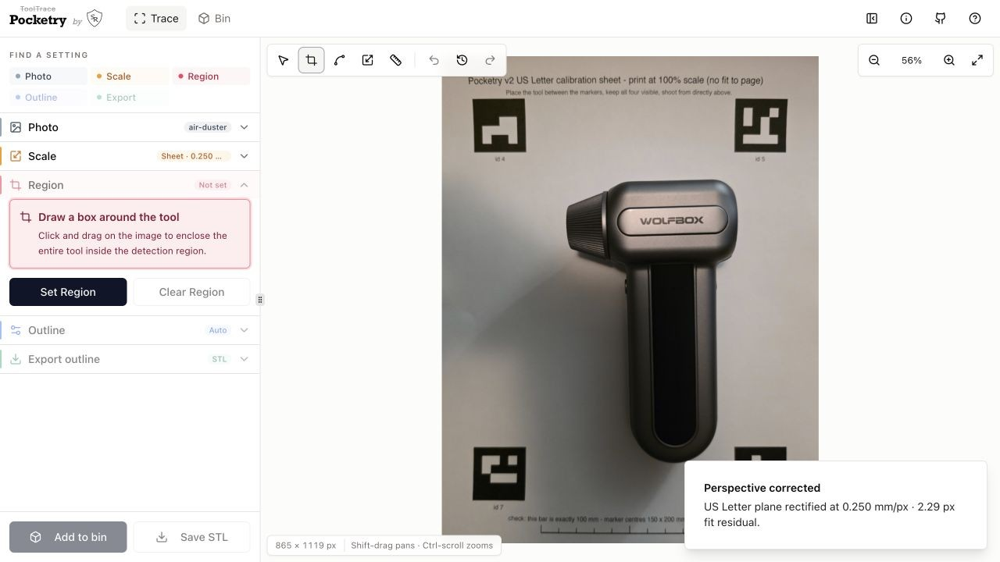

The correction straightens the photographed sheet and establishes millimetres per pixel. For your own photographs, print the sheet at 100% scale, verify the 100 mm bar, keep all four markers visible, and photograph the tool from above.

The **Set scale** control is for calibration. The ruler icon represents the separate measurement tool.

## 2. Set a region around the tool

1. Open **Region** and choose **Set Region**.
2. Drag a rectangle around the complete air duster.
3. Leave a small border around its physical edges, while excluding the printed markers and unrelated objects.

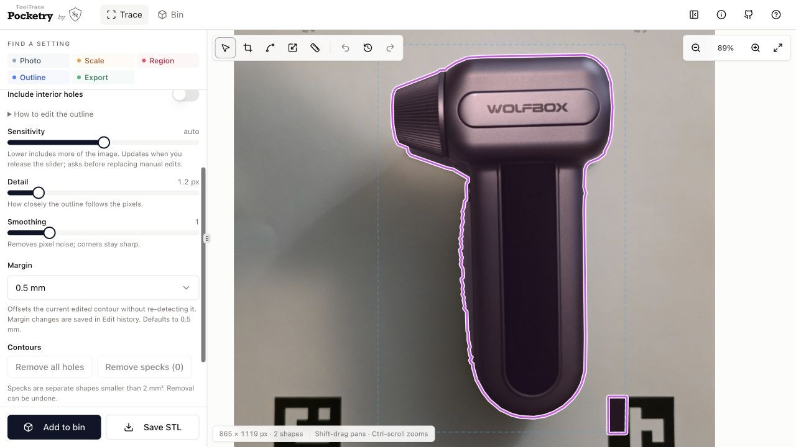

A region limits what the detector considers. It is especially useful when a photograph contains more than one object or distracting printing.

## 3. Detect the outside silhouette

1. Open **Outline**.
2. Leave **Include interior holes** switched off for these tools.
3. Inspect the outline against the physical edge of the duster.
4. Adjust **Sensitivity** if shadows or reflections pull the contour away from that edge.

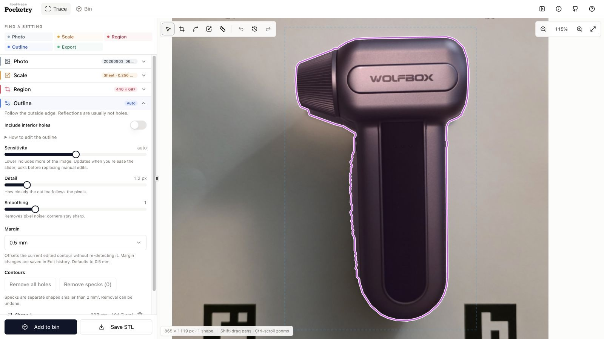

Outside silhouette is the default. Logos, highlights and details inside the solid body should not become holes in this pocket.

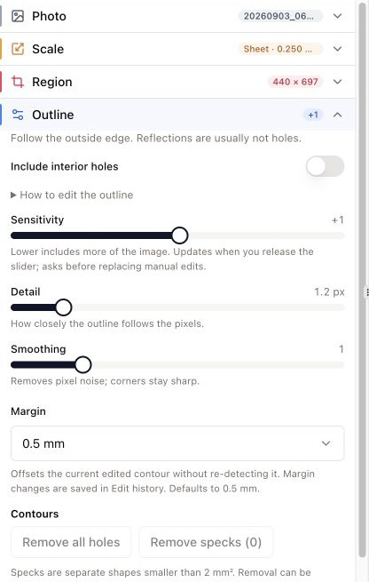

When the contour has no manual vertex edits, releasing the Sensitivity slider automatically detects the outline again. Tune it before detailed point editing where possible. After manual edits, Pocketry asks before replacing them; that confirmation is demonstrated in step 7.

Use **Detail** to simplify pixel noise while retaining important corners. The demonstration uses 8 px to make the points easier to inspect; use a smaller value when finer geometry needs to be preserved. **Smoothing** helps remove small irregularities.

## 4. Move, add and remove contour points

Choose **Edit points**, then select the shape to reveal its vertices.

Use these three operations while following the actual tool edge:

| Operation | Control | When it helps |
| --- | --- | --- |
| Move a vertex | Drag an existing point | The detected boundary is offset from the tool |
| Add a vertex | Click an outline edge | Another bend is needed to follow the silhouette |
| Remove a vertex | Right-click a point | A point follows noise or creates an unwanted kink |

At the handle, move misplaced points toward the physical edge rather than the shadow.

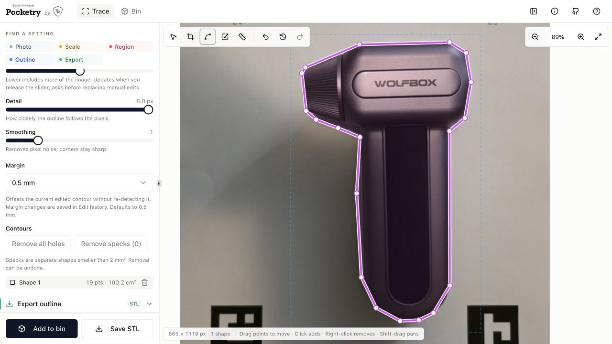

At the neck, add a point where the outline needs another turn.

Remove unnecessary points, then inspect the neighbouring segments. **Undo** recovers a change that makes the contour worse. Zoom out periodically to check the complete shape.

## 5. Name the duster and queue the next photo

1. Choose **Add to bin**.
2. Name the tool **Air Duster**. The screenshot uses “Air Duster — photo trace” to distinguish the demonstration from the original reference.
3. Choose **Add and trace another photo**.
4. Select `adapter-stack.jpg`.

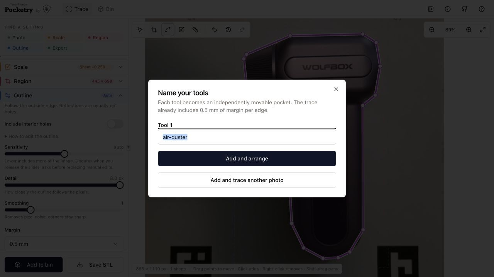

**Add and trace another photo** keeps the tool queued while you continue tracing. **Add and arrange** sends the queued tools to the bin designer when you are ready.

## 6. Trace and clean up the adapters

1. Accept the calibration sheet with **Correct perspective & use scale**.
2. Set a region around the adapter stack.
3. Adjust Sensitivity while inspecting the lower adapters.

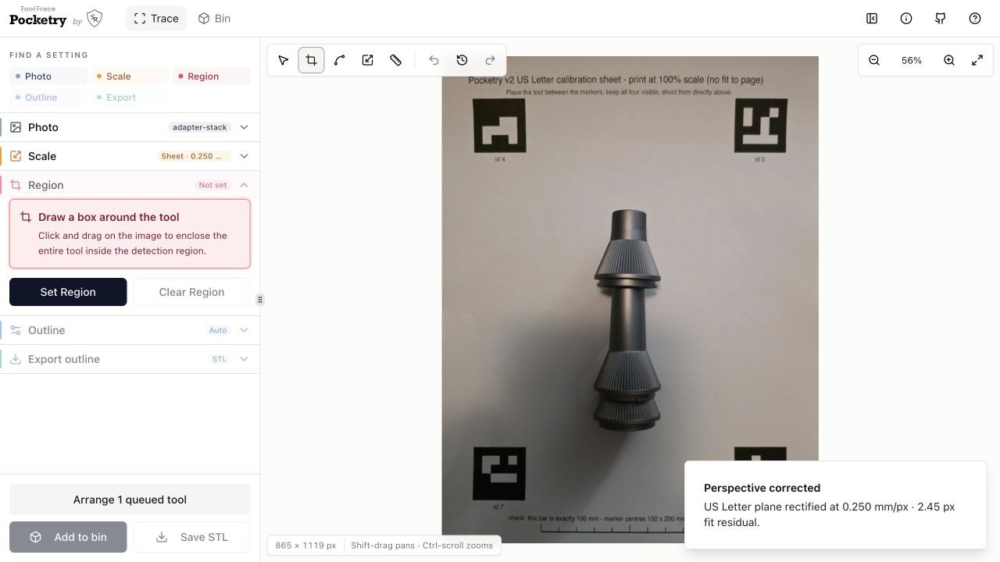

This photograph contains a reflection that creates a false inward notch. In the demonstration, reducing Sensitivity and temporarily setting Margin to 0 mm made that edge easier to inspect.

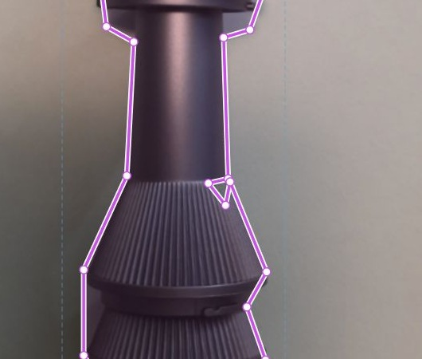

Choose **Edit points** and right-click the unwanted inward vertices. Check the resulting edge after each removal, adding or moving points if a real corner needs more definition.

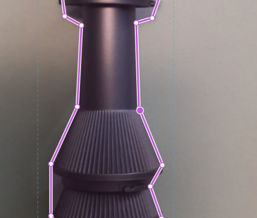

Restore **Margin** to 0.5 mm for this photo-tracing example.

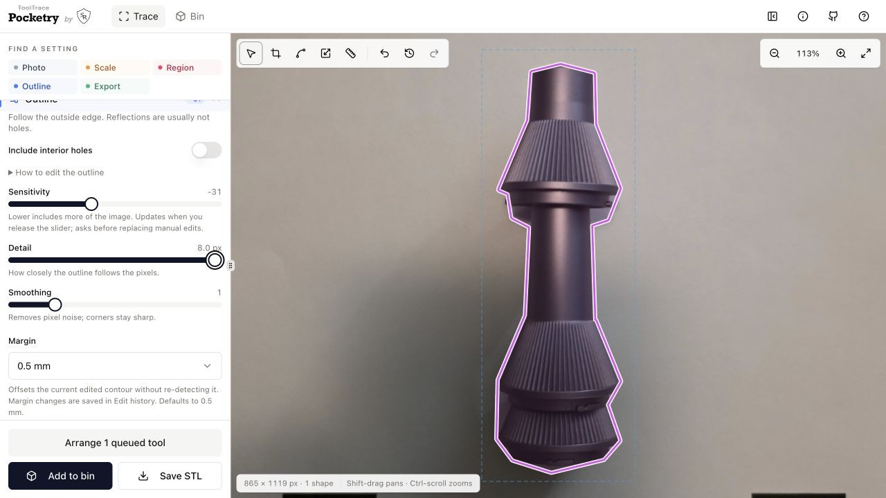

Margin offsets the current edited contour without detecting it again. A 0.5 mm margin is a starting allowance, not a guarantee of fit. Test it with the real tools before printing the full tray.

Choose **Add to bin**, name the shape **Adapters**, then choose **Add and trace another photo**.

## 7. Trace the angled nozzle and protect manual edits

Load `angled-nozzle.jpg`, apply the calibration-sheet correction, and set a region around the nozzle.

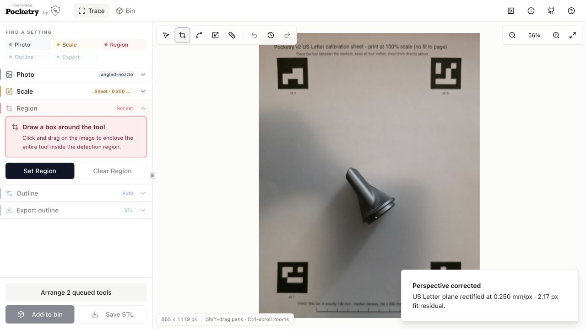

Select its contour in **Edit points** and zoom in. A bright streak can cause the outline to run inward along the nozzle.

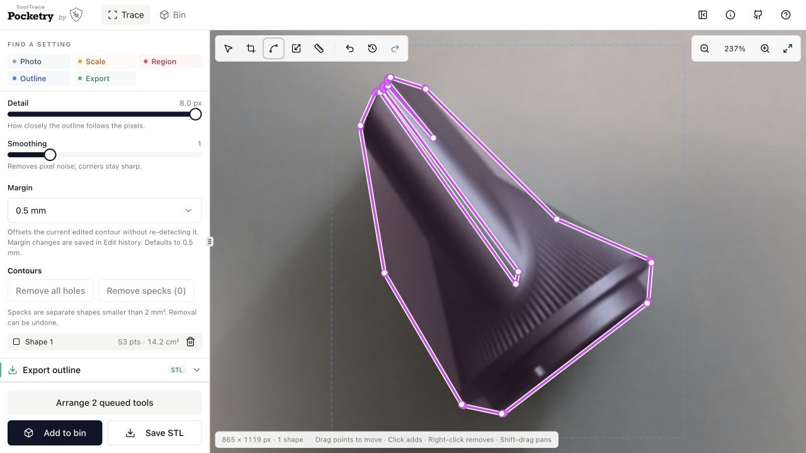

Right-click the inward vertices to remove that false notch. Continue inspecting the nozzle tip, sloping body and mounting flange against the photograph.

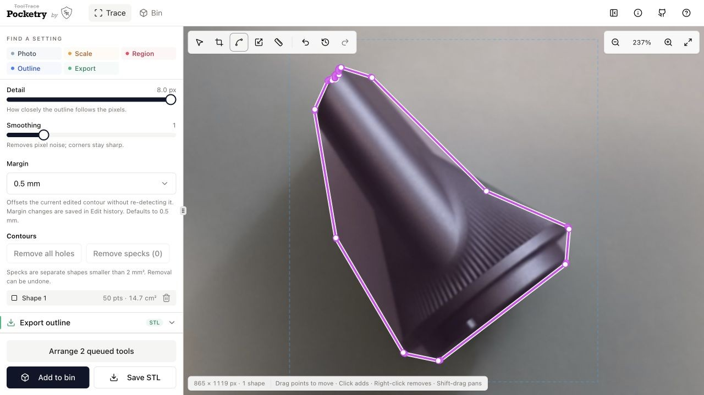

If you adjust **Sensitivity** now, Pocketry recognizes that vertices have been edited and asks before replacing the contour.

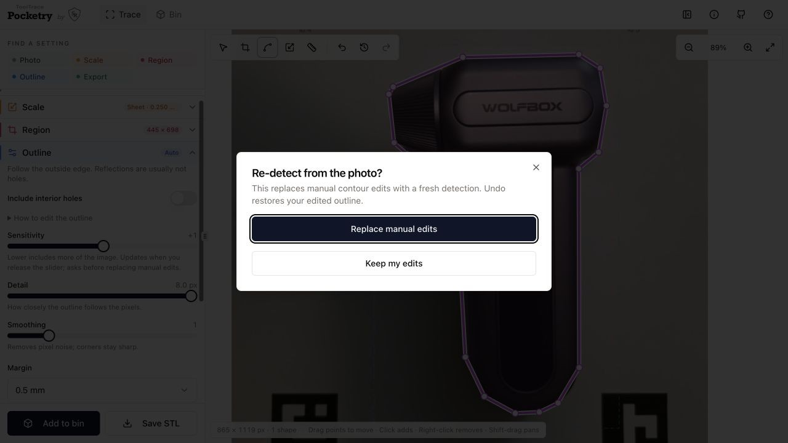

- Choose **Keep my edits** to retain the contour you refined.
- Choose **Replace manual edits** to run detection again. **Undo** can recover the previous edited outline.

Name the completed trace **Angled Nozzle**, then choose **Add and arrange** to take the queued tools into the bin designer.

## 8. Save the photo-tracing checkpoint

The first bin may be larger than the desired tray because Pocketry has arranged the queued tools to fit.

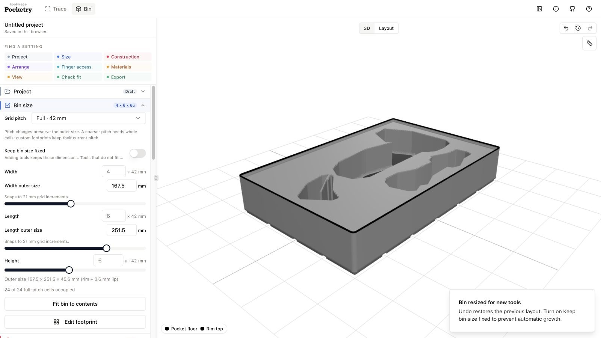

1. Open **Project**.
2. Choose **Save to library**.
3. Name this project **Photo tracing demonstration**.
4. Choose **Download editable project** to keep a portable copy.

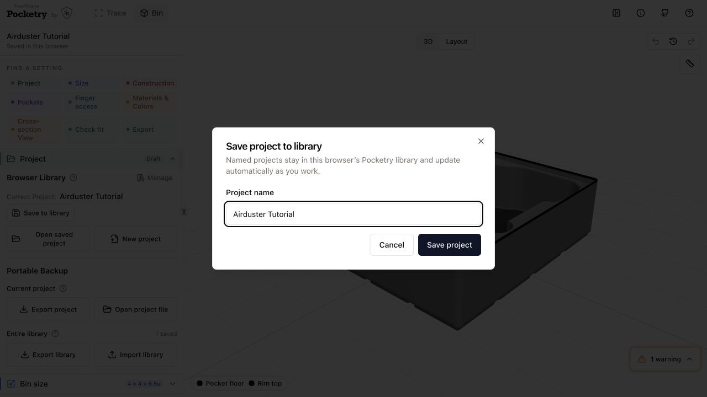

The library saves this work in the current browser. The `.pocketry.json` download is the editable copy you can keep or move to another browser.

## 9. Open the exact reference layout

To reproduce the supplied design precisely, use the [editable reference project](reference/Airduster-Tutorial.pocketry.json).

1. Save your photo-tracing work as described above.
2. In **Project**, choose **Open Pocketry project**.
3. Select `Airduster-Tutorial.pocketry.json`.
4. Save the imported draft to the library as **Airduster Tutorial** if needed.

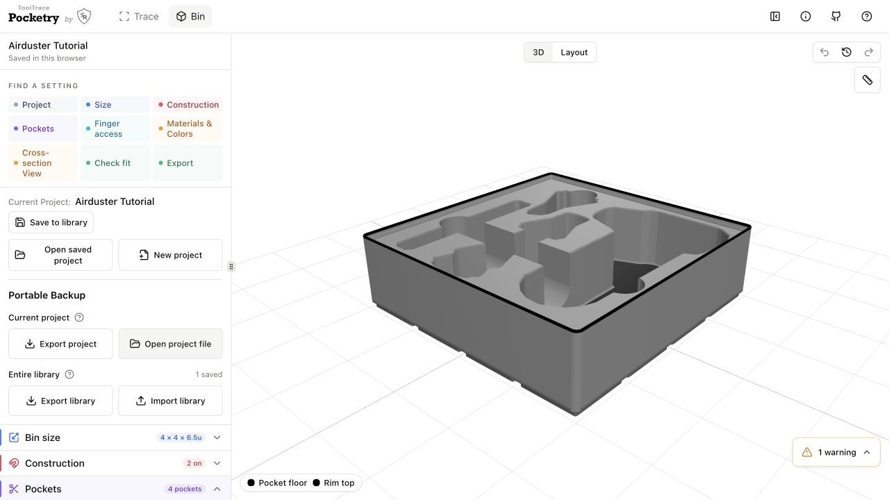

This checkpoint contains the original seven library shapes, four pocket placements, two independent finger openings and bin settings. The new photo traces demonstrate the workflow; the checkpoint supplies the exact reference vertices and placements for the remainder of this tutorial.

## 10. Set the bin size

Open **Size** and verify:

| Setting | Value |
| --- | --- |
| Grid pitch | Full, 42 mm |
| Width | 4 cells |
| Length | 4 cells |
| Height | 6.5u |
| Outside dimensions | 167.5 × 167.5 × approximately 49.1 mm |
| Construction | Solid fill and standard stacking lip |

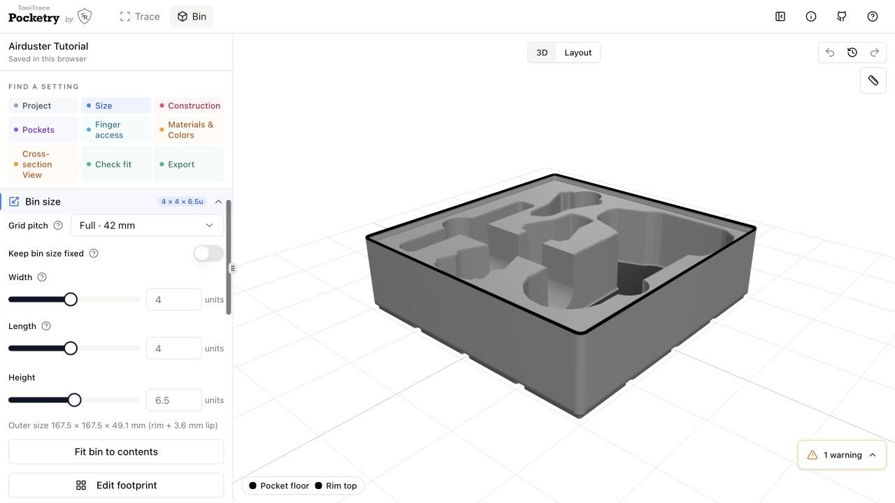

For a new layout, **Keep bin size fixed** prevents added tools from automatically growing the bin. It does not guarantee that every tool fits: inspect their placement and any validation messages.

## 11. Arrange the four pockets

Switch to **Layout** and open **Arrange**. Select a pocket in the list or directly in the layout. Click its name to rename it.

Positions are measured from the bin centre. Positive X is right; positive Y is up. Width and length describe the pocket before rotation.

| Pocket | X (mm) | Y (mm) | Width (mm) | Length (mm) | Rotation |
| --- | ---: | ---: | ---: | ---: | ---: |
| Air Duster | 33.49 | 3.55 | 87.83 | 145.57 | 0° |
| Adapters | -15.69 | -20.35 | 36.74 | 113.32 | 0.53° |
| Angled Nozzle | -42.00 | 47.89 | 45.43 | 52.75 | 143.04° |
| USB Cable | -60.06 | -21.21 | 17.44 | 103.59 | -1.5° |

The checkpoint retains full precision. These values are rounded for reading beside the controls. If you enter the rounded values manually, you are making a close reproduction rather than a numerically identical copy.

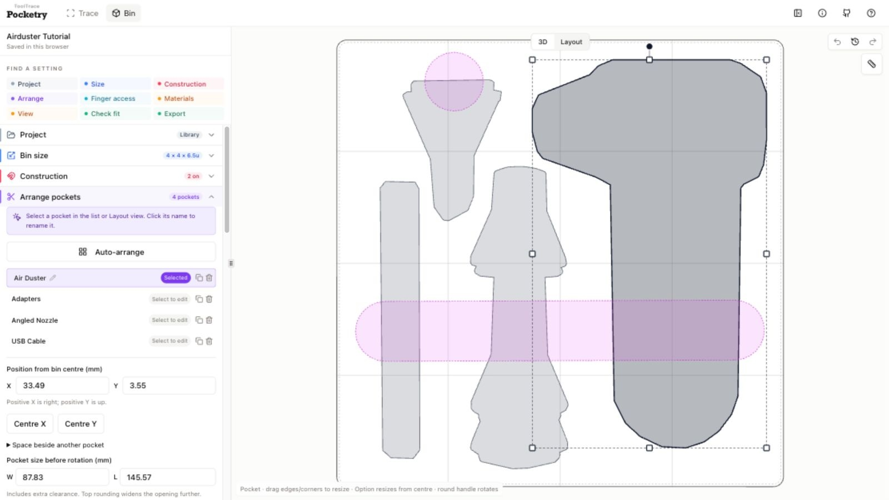

Change X or Y to position a pocket precisely, or drag it in Layout. Use width and length or the edge/corner handles to resize it. Lock the aspect ratio when you want to preserve its proportions. Check clearance to neighbouring pockets and the outside wall after adjusting a shape.

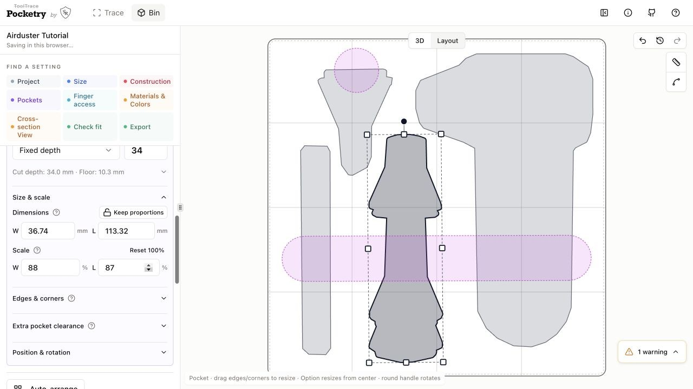

The adapter stack sits in the middle of the bin.

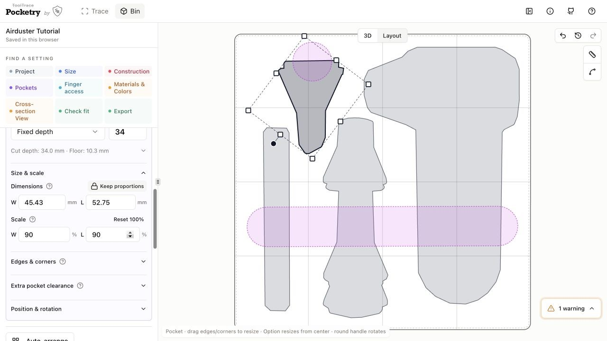

The angled nozzle uses its traced outline and a rotation of about 143°. It is a different pocket from the USB cable channel.

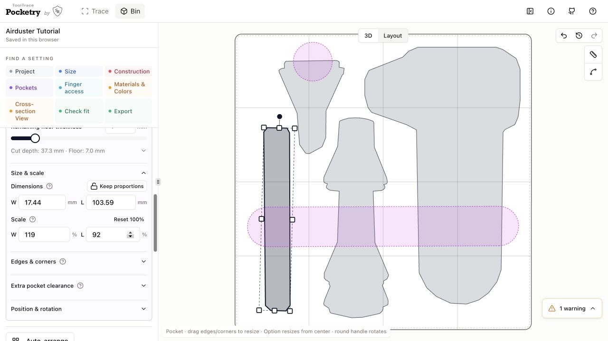

Keep the original cable outline when reproducing this checkpoint. In a new design, an oblong finger pocket can make an approximate cable recess; its rounded ends and bottom will differ from the supplied outline.

## 12. Set pocket depths and rounding

Select each pocket and inspect its depth controls.

| Pocket | Depth mode | Value |
| --- | --- | --- |
| Air Duster | Fixed depth | 39 mm |
| Adapters | Fixed depth | 34 mm |
| Angled Nozzle | Fixed depth | 34 mm |
| USB Cable | Keep floor thickness | 7 mm |

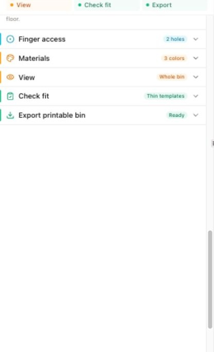

The duster's 39 mm cut leaves approximately 5.3 mm of floor. The depth diagram distinguishes the infill top, remaining floor and stacking rim. **Inspect this pocket in 3D** opens a section view for closer inspection; preview cuts do not remove geometry from exports.

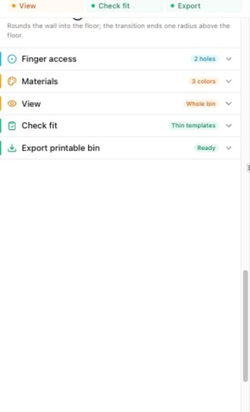

The cable setting controls the material left underneath its pocket. It corresponds to approximately 37.3 mm of cut depth in this bin.

For all four reference pockets, use:

| Setting | Value |
| --- | --- |
| Extra pocket clearance | 0 mm |
| Outline corner round | 1 mm |
| Top edge round | 1 mm |
| Bottom fillet | 1.2 mm |

**Avoid adding clearance twice.** The new photo-tracing example used a 0.5 mm Trace margin. Extra pocket clearance is added after any Trace margin. The older reference outlines have unknown margin provenance; the checkpoint intentionally keeps extra clearance at zero.

## 13. Configure finger access

Open **Finger access**. **Add hole** creates an independent opening. Select its type, set its dimensions, and position it in Layout.

The supplied checkpoint already contains the two required openings; select them to inspect or adjust their settings rather than adding duplicates.

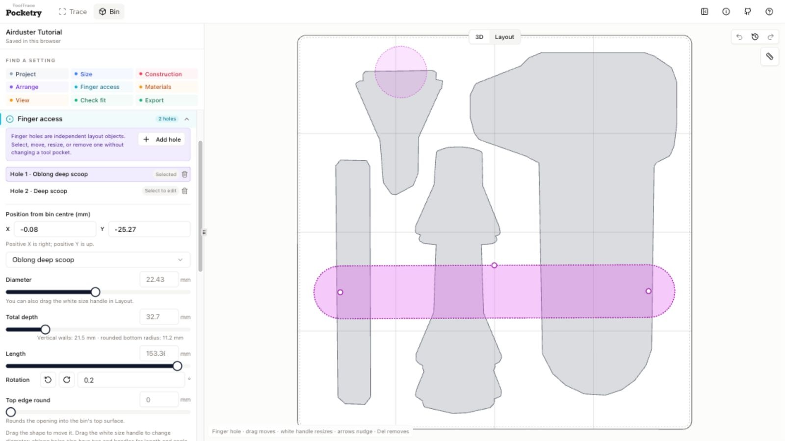

| Opening | Type | X (mm) | Y (mm) | Diameter (mm) | Length (mm) | Total depth (mm) | Rotation |
| --- | --- | ---: | ---: | ---: | ---: | ---: | ---: |
| Cross-bin access | Oblong deep scoop | -0.08 | -25.27 | 22.43 | 153.36 | 32.7 | 0.207° |
| Nozzle access | Deep scoop | -39.78 | 68.13 | 22 | — | 33.5 | — |

The long scoop spans the tools to provide lifting access. Its end handles adjust length and angle; its white size handle adjusts diameter.

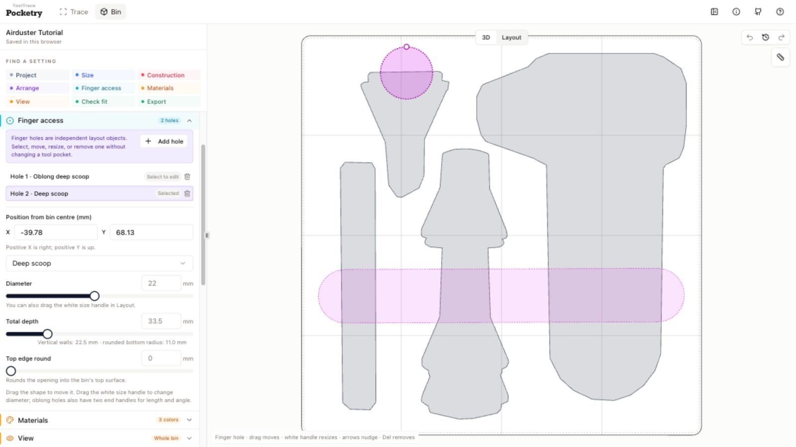

The second scoop provides access at the top of the angled nozzle pocket. Both reference finger openings use zero top and bottom edge rounding.

## 14. Choose the material colors

Open **Materials** and set the following:

| Region | Color | Color-region thickness |
| --- | --- | --- |
| Bin body | Gray, `#BFBFBF` | — |
| Pocket floors | Black, `#000000` | 0.6 mm |
| Rim top | Black, `#000000` | 1.25 mm |

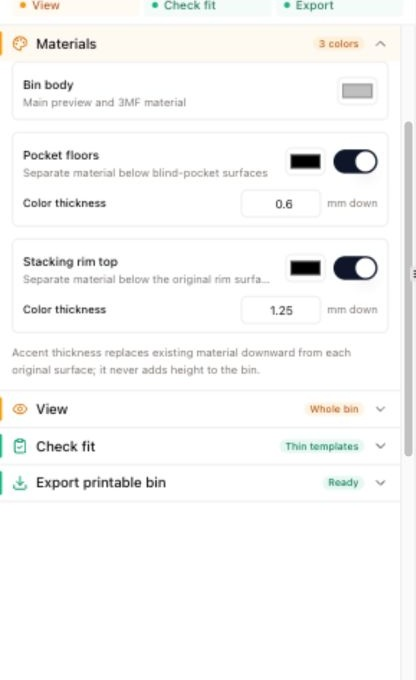

Enable the pocket-floor and rim color regions. These thicknesses define the separate material volumes, not the full thickness of the floor or lip.

Verify Materials when reopening the JSON: color preferences are separate from the project geometry saved in that file.

Switch to **3D** and inspect the full model, especially the walls between pockets and the finger openings.

## 15. Export a complete surface fit test

1. Open **Check fit**.
2. Find **Complete surface fit test**.
3. Set **Thickness** to **1.2 mm**.
4. Choose **Save surface fit test STL**.
5. Confirm that the STL and its matching editable `.pocketry.json` backup have downloaded. Allow multiple downloads if the browser asks.

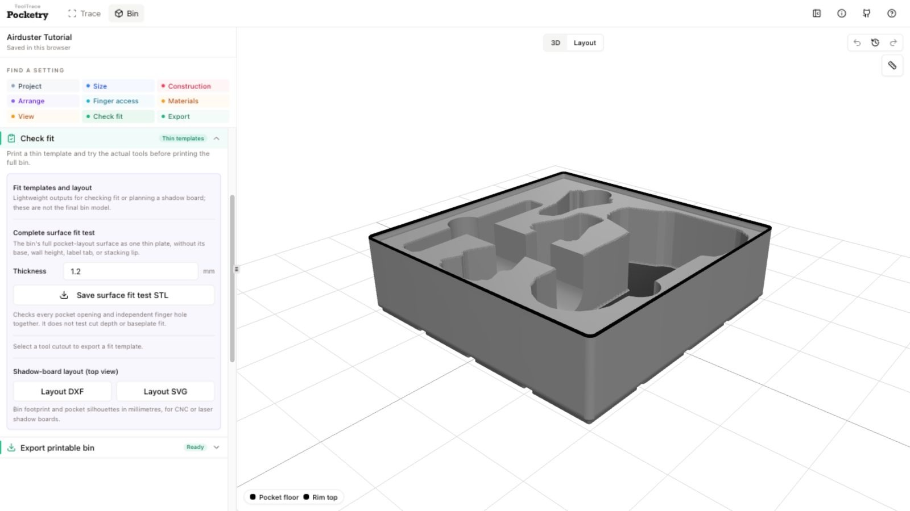

Print this thin plate and try the real tools before printing the full bin. It checks all pocket openings and independent finger openings together.

The surface test does **not** check pocket depth or baseplate engagement. If the openings need adjustment, return to the contours or pocket-clearance settings, change them, and export another fit test. Physical fit has not been tested as part of this walkthrough.

## 16. Export the final multi-color 3MF

Once the physical fit is satisfactory:

1. Open **Export**.
2. Choose **Save 3MF**.
3. Choose **Multi-color 3MF** to preserve the separate body, pocket-floor and rim regions.
4. Confirm that the 3MF and its matching `.pocketry.json` backup have downloaded.
5. Open the 3MF in your slicer and verify the object and filament assignments before slicing.

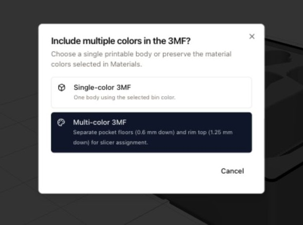

This export contains the complete bin, including its base, pockets and stacking lip. Slicer handling of color regions can vary, so check the assignments rather than assuming the preview colors automatically select your filaments.

## 17. Keep the editable project

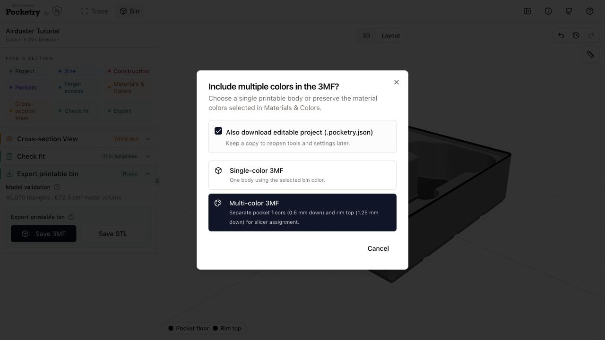

Keep these files together:

- The final **3MF** for printing.
- The **surface fit-test STL** for checking the openings.
- The editable **`.pocketry.json`** for reopening and changing the design.
- The clean **reference photos** for checking or retracing the tools.

Use **Project → Open Pocketry project** when you want to continue editing. The supplied checkpoint retains the original saved geometry and corrects the accessory labels; your original project and source photos remain unchanged.
