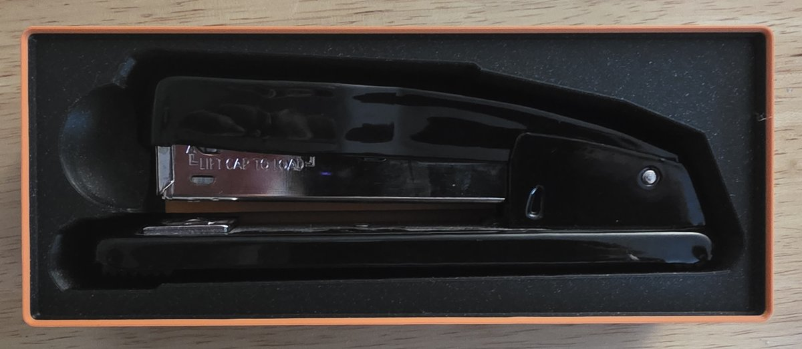
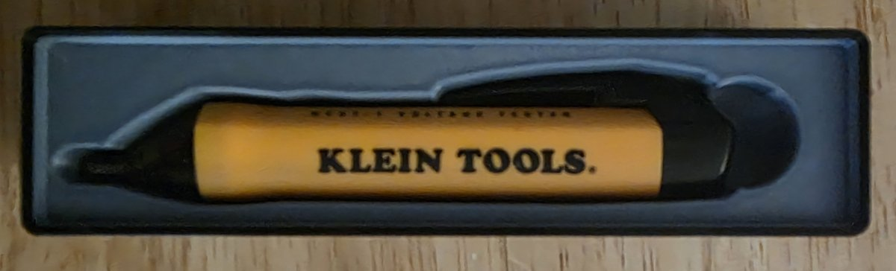
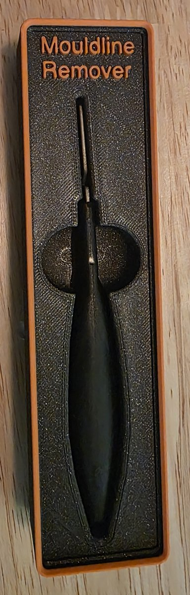

# Sample projects

Editable Pocketry designs and the 3MF exports used for the printed bins.
Start with a project to see how its pockets are arranged, or download a 3MF to
open in your slicer.

[Open Pocketry](https://pocketry.xyz) · [Back to the project](../README.md)

**[Download all eight projects as one library](pocketry-sample-library.json).**
Open the file on GitHub and choose **Download raw file**, then in Pocketry use
**Bin → Project → Manage library → Import library**. The designs are added to
your library; select one there to open it. Existing projects are preserved.

| Design | Printed bin | Files | Highlights |
| --- | :---: | --- | --- |
| [Wolfbox MF70 Airduster Kit](wolfbox-mf70-airduster-kit/) |  | [JSON](wolfbox-mf70-airduster-kit/wolfbox-mf70-airduster-kit.pocketry.json) [3MF](wolfbox-mf70-airduster-kit/wolfbox-mf70-airduster-kit.3mf) | Tools, accessories, and shared finger access |
| [DeWalt right-angle tools](dewalt-right-angle-tools/) |  | [JSON](dewalt-right-angle-tools/dewalt-right-angle-tools.pocketry.json) [3MF](dewalt-right-angle-tools/dewalt-right-angle-tools.3mf) | Multiple pockets and shared finger access |
| [Ryobi cutter](ryobi-cutter/) |  | [JSON](ryobi-cutter/ryobi-cutter.pocketry.json) [3MF](ryobi-cutter/ryobi-cutter.3mf) | Non-rectangular footprint; two-level pocket |
| [Caliper storage](caliper-storage/) |  | [JSON](caliper-storage/caliper-storage.pocketry.json) [3MF](caliper-storage/caliper-storage.3mf) | Calipers, measurement strips, and battery storage |
| [Stapler](stapler/) |  | [JSON](stapler/stapler.pocketry.json) [3MF](stapler/stapler.3mf) | Two-level pocket |
| [Wire strippers](wire-strippers/) |  | [JSON](wire-strippers/wire-strippers.pocketry.json) [3MF](wire-strippers/wire-strippers.3mf) | Fitted outline and finger access |
| [Klein voltage tester](klein-voltage-tester/) |  | [JSON](klein-voltage-tester/klein-voltage-tester.pocketry.json) [3MF](klein-voltage-tester/klein-voltage-tester.3mf) | Compact single-tool bin |
| [Citadel mouldline remover](mouldline-remover/) |  | [JSON](mouldline-remover/mouldline-remover.pocketry.json) [3MF](mouldline-remover/mouldline-remover.3mf) | Fitted tool pocket and rounded finger access |

The **caliper** and **DeWalt right-angle** bins are not stackable with the tools
in place as designed: the tools extend above the top surface. Modify the designs
before stacking another bin on top.

## Using a sample

1. Download a `.pocketry.json` file. On GitHub, open the file and choose **Download raw file**.
2. Open [Pocketry](https://pocketry.xyz), switch to **Bin**, and choose **Open project**.
3. Select the downloaded JSON to inspect or edit the bin, pockets, depths, and finger access.
4. To print the supplied model, download its `.3mf` and open it in your slicer at **100% scale**. Choose filament and print settings, check the layer preview, and print a fit check if adapting it to your tools.

The 3MFs include the bin geometry and color parts. Use your own printer,
material, and process settings. A JSON is the editable design, and does not
carry the slicer's settings or all 3MF color selections.

## Print photos

All eight designs include photographs of their finished bins. Except for the
DeWalt set, each sample also includes a view with the main tool removed.
The photos are cropped, rotated for viewing, resized, and stripped of embedded
metadata. No generative editing was used.

## Reuse and attribution

These designs and photographs were supplied by Will Cobb and are distributed
under the repository's [AGPL-3.0-only license](../LICENSE). Product names and marks
belong to their respective owners. See [NOTICE](../NOTICE) for attribution and
[source-files.json](source-files.json) for file provenance and hashes.

If you share a design made with Pocketry, please link to
[pocketry.xyz](https://pocketry.xyz).
