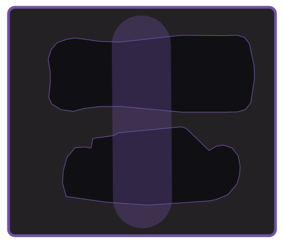

<a href="../README.md">All samples</a>

# Bessey (aka "Bessy") Utility Knife and Gerber Multitool

A shared Gridfinity bin for a closed Bessey D-BKWH folding utility knife
and Gerber Multitool. Two fitted pockets keep the tools side by side, with a
long rounded finger-access opening between them.

- **Bin size:** 7 × 6 half-pitch grid (3.5 × 3 full-size cells); 4.5u. The footprint is 146.5 × 125.5 mm, with an overall height of 35.05 mm including the stacking lip.
- **Base:** Gridfinity, with a stacking lip and 69% solid fill height.
- **Pocket depths:** Bessey 9.78 mm; Gerber 16.28 mm.
- **Print model:** [bessey-gerber.3mf](bessey-gerber.3mf).
- **Editable project:** [bessey-gerber.pocketry.json](bessey-gerber.pocketry.json).

[How to open, edit, and print](../README.md#using-a-sample) ·
[Complete editable sample library](../pocketry-sample-library.json).

[Bessey D-BKWH on Amazon](https://link.amazon/B04v0c3oz) (affiliate link*).

## Original printed bin

The label says **Bessy**. We’re now aware that **Bessey** is spelled with two e’s. At least the knife fits.

The lettering shown in the photo is not included in the downloadable design.
The 3MF includes separate body, pocket-floor, and rim color parts. Use your own
filament, printer, and process settings at **100% scale**.

## Layout

For individual storage, use the [Bessey bin](../bessey-utility-knife/) or the
[Gerber bin](../gerber-multitool/). Compare the pockets with your tools and
print a fit check when adapting the design.

*As an Amazon Associate I earn from qualifying purchases.*
