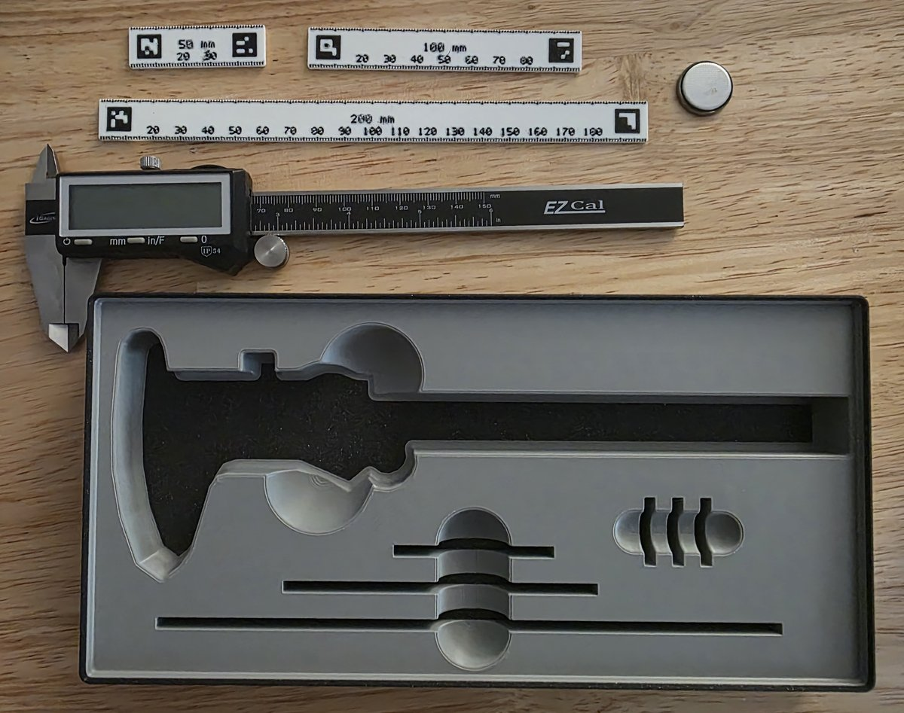

# Caliper storage

Storage for digital calipers, 50 mm, 100 mm, and 200 mm measurement strips, and
three spare coin-cell batteries. Separate finger-access openings make the
calipers, strips, and batteries easy to lift from their pockets.

- **Size:** 6 × 3; 3.5u. Grid cells are 42 mm; one height unit is 7 mm, before the stacking lip.
- **Base:** Gridfinity.
- **Print model:** [caliper-storage.3mf](caliper-storage.3mf).
- **Editable project:** [caliper-storage.pocketry.json](caliper-storage.pocketry.json).

[How to open, edit, and print](../README.md#using-a-sample).

**Stacking:** As designed, the tools extend above the bin's top surface. Another
bin cannot be stacked on top with the tools in place without modifying the design.

## Printed bin

[All samples](../README.md)
