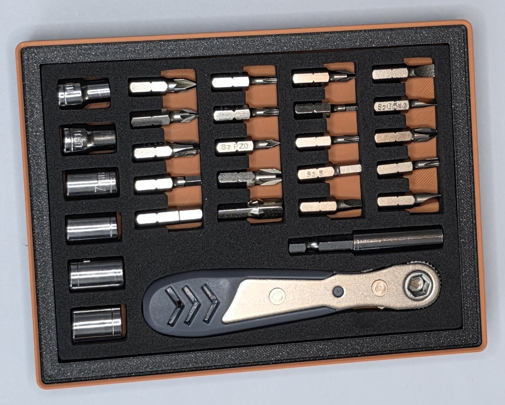
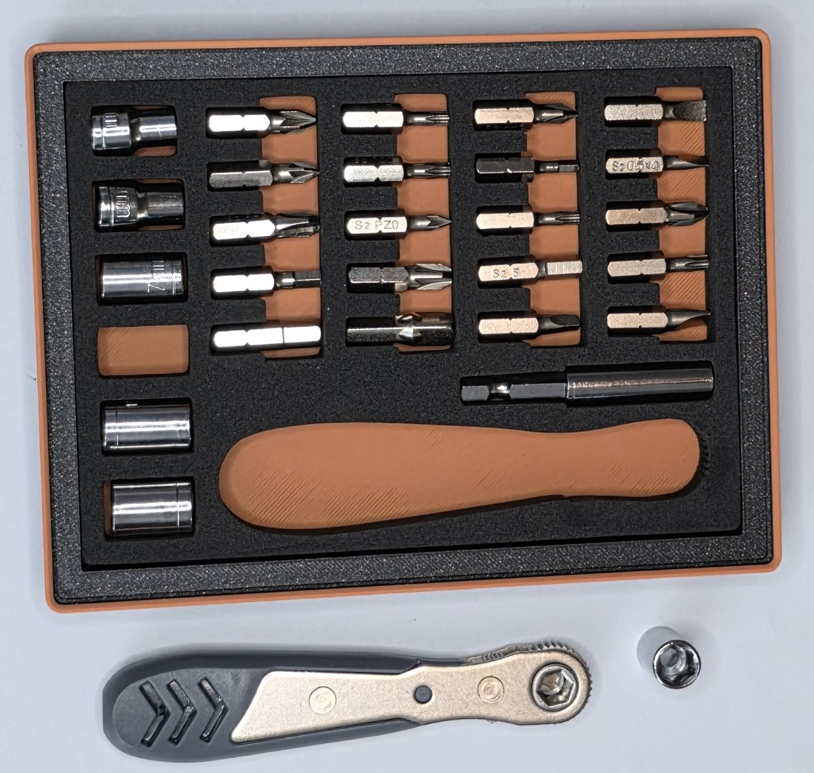
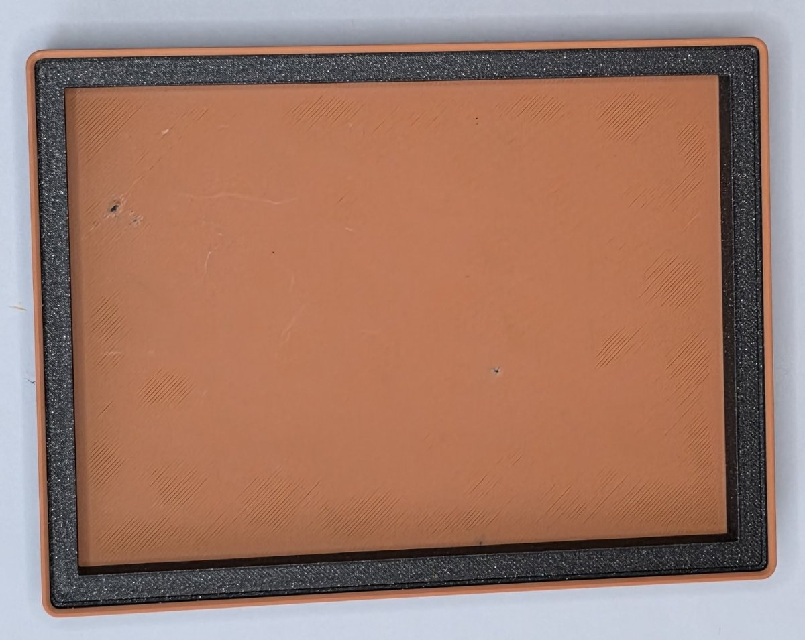

# Mini Socket Set

A compact bin for a mini ratchet, sockets, and driver bits.

For this design, we reused the pre-cut shadowbox that came with the toolset.
The printed bin has a single rectangular recess to hold it.

- **Size:** 4 × 3; 2.5u. Grid cells are 42 mm; one height unit is 7 mm, before the stacking lip.
- **Base:** Gridfinity.
- **Print model:** [mini-socket-set.3mf](mini-socket-set.3mf).
- **Editable project:** [mini-socket-set.pocketry.json](mini-socket-set.pocketry.json).

[How to open, edit, and print](../README.md#using-a-sample).

## Printed bin

[All samples](../README.md)
