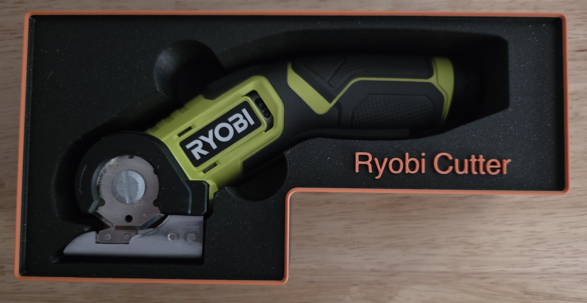
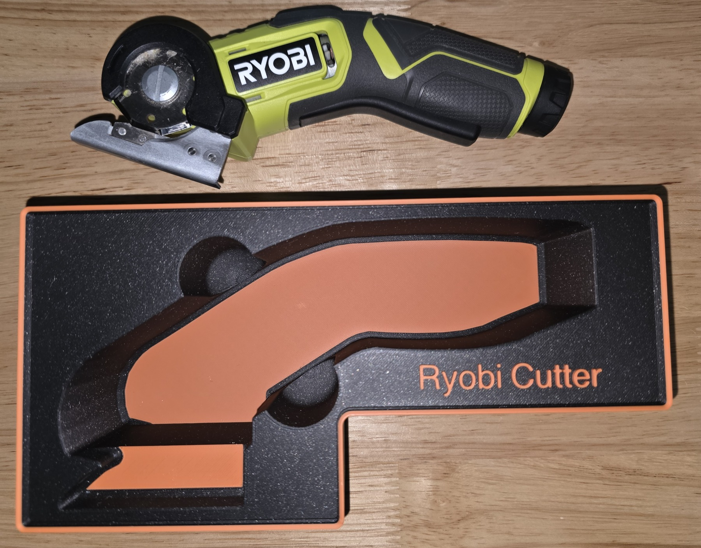

# Ryobi cutter

A non-rectangular, 15-cell footprint and a two-level tool pocket for the cutter.

- **Size:** 6 × 3 bounding grid; 9u. Grid cells are 42 mm; one height unit is 7 mm, before the stacking lip.
- **Base:** Gridfinity.
- **Print model:** [ryobi-cutter.3mf](ryobi-cutter.3mf).
- **Editable project:** [ryobi-cutter.pocketry.json](ryobi-cutter.pocketry.json).

[How to open, edit, and print](../README.md#using-a-sample).

The editable project was recovered from the printed 3MF and checked against its
mesh before rounding editable settings to tenths. It includes the 9u Gridfinity base, 15-cell footprint, 14 mm / 55 mm pocket
depths, and finger-access slot.

## Printed bin

[All samples](../README.md)
