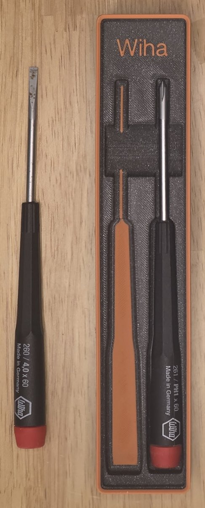

<a href="../README.md">All samples</a>

# Wiha 60 mm drivers

A pair of Wiha precision screwdrivers with 60 mm blades: a **260 / 4.0 × 60
slotted driver** and a **261 / PH1 × 60 Phillips driver**. Linked shaped pockets
and shared finger access keep both drivers aligned and easy to lift out.

- **Blade length:** 60 mm.
- **Bin size:** 1 × 5 grid; 3u. The footprint is 41.5 × 209.5 mm, with an overall height of 24.55 mm including the stacking lip.
- **Base:** Gridfinity, with a stacking lip and 80% solid fill height.
- **Print model:** [wiha-60mm-drivers.3mf](wiha-60mm-drivers.3mf).
- **Editable project:** [wiha-60mm-drivers.pocketry.json](wiha-60mm-drivers.pocketry.json).

[How to open, edit, and print](../README.md#using-a-sample) ·
[Complete editable sample library](../pocketry-sample-library.json).

## Fit and stacking

The drivers sit slightly too high to stack the loaded bins without some
interference. If stacking is desired, lower the driver pockets by about **1 mm**
in the editable project before exporting a revised print model.

## Printed bin

The supplied 3MF includes separate parts for the bin body, pocket floors,
stacking rim, and raised **Wiha** lettering. The lettering is editable in the
project. Use your own filament, printer, and process settings at **100% scale**.

## Stacked in a drawer

See the other blade lengths: [40 mm](../wiha-40mm-drivers/),
[50 mm](../wiha-50mm-drivers/), [60 mm](../wiha-60mm-drivers/),
and [150 mm](../wiha-drivers/).
