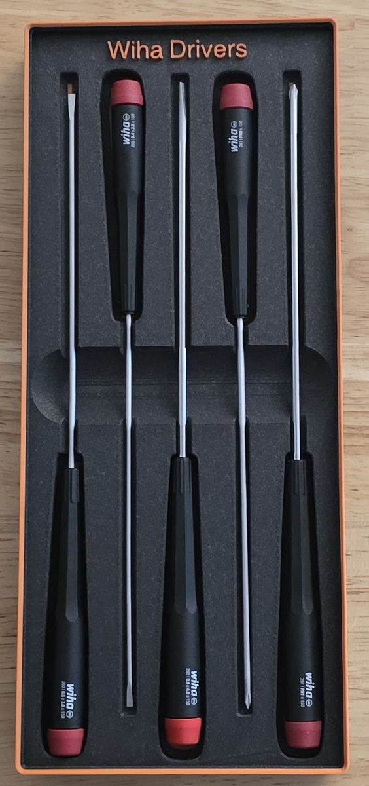

# Wiha drivers

Five Wiha screwdrivers with shared finger access. An 80% solid fill height
allows stacking without fully recessing the screwdrivers into the solid fill.

- **Size:** 3 × 7 grid; 3.5u. Grid cells are 42 mm; one height unit is 7 mm, before the stacking lip.
- **Base:** Gridfinity.
- **Print model:** [wiha-drivers.3mf](wiha-drivers.3mf).
- **Editable project:** [wiha-drivers.pocketry.json](wiha-drivers.pocketry.json).

[How to open, edit, and print](../README.md#using-a-sample).

## Printed bin

The lettering shown in the photo is not included in the project or 3MF.

[All samples](../README.md)
