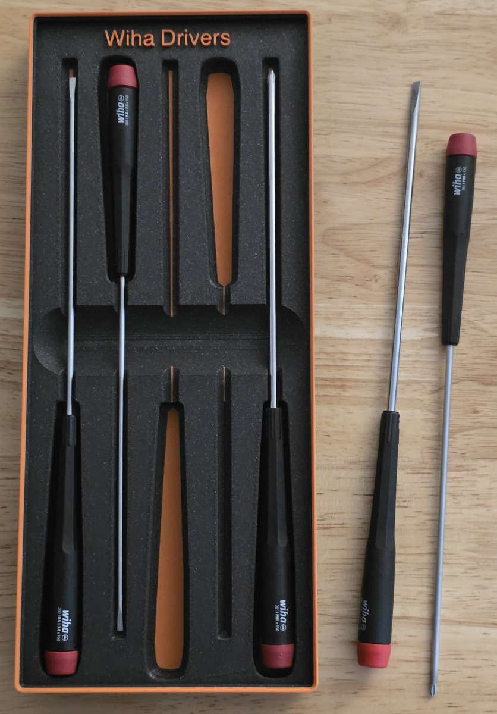

<a href="../README.md">All samples</a>

# Wiha 150 mm drivers

Five Wiha precision screwdrivers with 150 mm blades and shared finger access. An 80% solid fill height
allows stacking without fully recessing the screwdrivers into the solid fill.

- **Blade length:** 150 mm.
- **Size:** 3 × 7 grid; 3.5u. Grid cells are 42 mm; one height unit is 7 mm, before the stacking lip.
- **Base:** Gridfinity.
- **Print model:** [wiha-drivers.3mf](wiha-drivers.3mf).
- **Editable project:** [wiha-drivers.pocketry.json](wiha-drivers.pocketry.json).

[How to open, edit, and print](../README.md#using-a-sample).

## Printed bin

The lettering shown in the photos is not included in the project or 3MF.

## Stacked in a drawer

See the other blade lengths: [40 mm](../wiha-40mm-drivers/),
[50 mm](../wiha-50mm-drivers/), and [60 mm](../wiha-60mm-drivers/).
