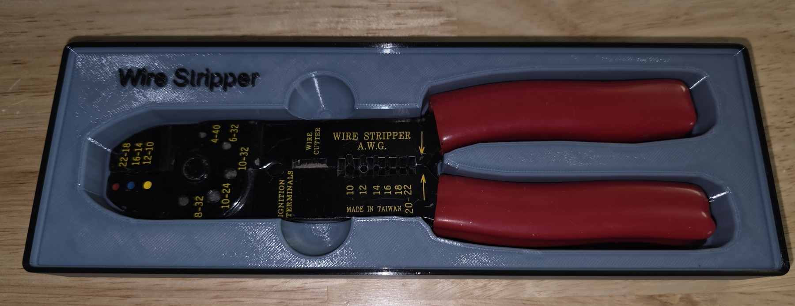
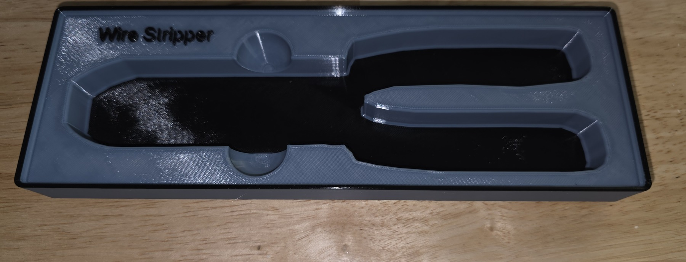

# Wire strippers

A fitted wire-stripper pocket with a slot for lifting the tool.

- **Size:** 6 × 2; 3.5u. Grid cells are 42 mm; one height unit is 7 mm, before the stacking lip.
- **Base:** Gridfinity.
- **Print model:** [wire-strippers.3mf](wire-strippers.3mf).
- **Editable project:** [wire-strippers.pocketry.json](wire-strippers.pocketry.json).

[How to open, edit, and print](../README.md#using-a-sample).

## Printed bin

[All samples](../README.md)
