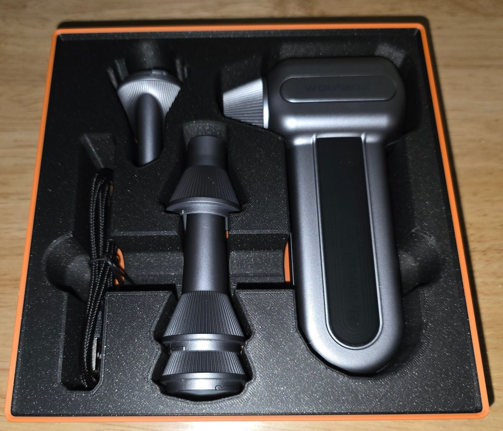
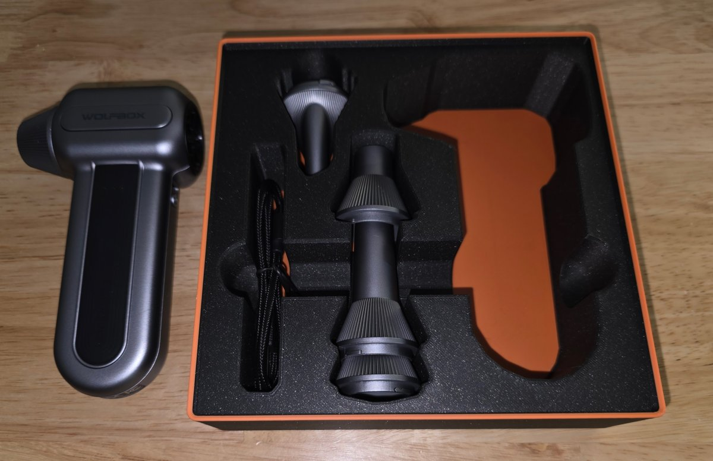

# Wolfbox MF70 Airduster Kit

Four pockets for the Wolfbox MF70 airduster, nozzle adapters, angled nozzle, and
USB cable, with shared finger access for lifting the tools and accessories.

- **Size:** 4 × 4; 6.5u. Grid cells are 42 mm; one height unit is 7 mm, before the stacking lip.
- **Base:** Gridfinity.
- **Print model:** [wolfbox-mf70-airduster-kit.3mf](wolfbox-mf70-airduster-kit.3mf).
- **Editable project:** [wolfbox-mf70-airduster-kit.pocketry.json](wolfbox-mf70-airduster-kit.pocketry.json).

[How to open, edit, and print](../README.md#using-a-sample).

## Printed bin

[All samples](../README.md)
